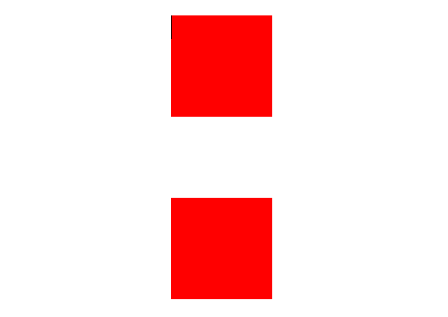
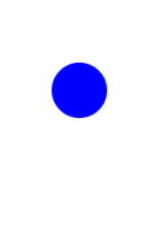

# Animation

## 1. Animation

특정 HTML 요소에 적용되는 CSS 스타일을 다른 CSS 스타일로 부드럽게 전환시켜 주는 것이다.

**키프레임(`@keyframes`)** : 애니메이션의 중간 상태

애니메이션은 transition보다 더 규모가 크고 복잡 => 정밀한 효과 가능

## 2. keyframes 정의

- **`from(시작) ~ to(끝)`를 이용한 애니메이션 `shape` 생성**

```
@keyframes shape {
    from {
        border: 1px solid transparent;
    }
    to {
        border: 1px solid #000;
        border-radius: 50%;
    }
}
```

- **`from ~ {percent} ~ to`를 이용한 애니메이션 `background` 생성**

```
@keyframes background {
    from { background-color: red; }
    50% { background-color: green; } /* percentage로 중간 스타일을 적용 */
    to { background-color: blue; }
}
```

## 3. Animation 속성

- **`animation-name`**

    - 애니메이션의 중간 상태를 지정하기 위한 이름을 정의한다.

    - 중간 상태는 `@keyframes` 규칙을 사용한다.

    ```
    animation-name: shape;

    @keyframes shape {
        ...
    }
    ```

- **`animation-duration`**

    - 한 사이클의 애니메이션이 몇 초 지속될 지 지정한다.

- **`animation-delay`**

    - 몇 초 뒤에 애니메이션이 시작될 지 지정한다.

- **`animation-iteration-count`**

    - 애니메이션이 몇 번 반복될지 지정한다.

    - `infinite`로 지정하면 무한히 반복

- **`animation-play-state`**

    - 애니메이션을 멈추거나 다시 시작 가능하다.

- **`animation-timing-function`**

    - 중간 상태들의 전환을 어떤 시간 간격으로 진행할 지 지정한다.

- **`animation-fill-mode`**

    - 애니메이션 시작 전이나 끝난 이후 어떤 값이 적용될 지 지정한다.

- **`animation`**

    - 단축 속성으로 한 번에 작성 가능하다.

<hr>

```
<head>
    <style>
        .shape {
            margin: 0 auto;
            margin-top: 80px;
            width: 100px;
            height: 100px;
            background-color: red;
        }
    </style>
</head>
<body>
    <main class="container">
        <div class="shape animation1"></div>
        <div class="shape animation2"></div>
    </main>
</body>
```



<hr>

### Animation-name

```
<head>
    <style>
        .shape {
            margin: 0 auto;
            margin-top: 80px;
            width: 100px;
            height: 100px;
            background-color: red;
        }

        .animation1 {
            animation-name: shape-color;
            animation-duration: 5s;
        }
        @keyframes shape-color {
            from {
                background-color: red;
            }
            to {
                background-color: blue;
            }
        }
    </style>
</head>
<body>
    <main class="container">
        <div class="shape animation1"></div>
        <div class="shape animation2"></div>
    </main>
</body>
```


**`animation-name: 에니메이션 명`과 `@keyframes 애니메이션 명`이 동일해야 한다.**

**`animation-duration`을 통해 애니메이션 지속 시간은 5s**

<hr>

**빨간색 사각형 -> 노란색 사각형 -> 파란색 사각형으로 변하는 애니메이션 정의**

```
<head>
    <style>
        .shape {
            margin: 0 auto;
            margin-top: 80px;
            width: 100px;
            height: 100px;
            background-color: red;
        }

        .animation1 {
            animation-name: shape-color;
            animation-duration: 5s;
        }
        @keyframes shape-color {
            0% {
                background-color: red;
        }
            50% {
                background-color: yellow;
            }
            100% {
                background-color: blue;
            }
        }
    </style>
</head>
<body>
    <main class="container">
        <div class="shape animation1"></div>
        <div class="shape animation2"></div>
    </main>
</body>
```


**`from {} ~ percent {} ~ to {}`도 가능**

<hr>

### Animation-iteration-count

```
<head>
    <style>
        .shape {
            margin: 0 auto;
            margin-top: 80px;
            width: 100px;
            height: 100px;
            background-color: red;
        }

        .animation1 {
            animation-name: shape-color;
            animation-duration: 5s;
            animation-iteration-count: 3;
        }
        @keyframes shape-color {
            0% {
                background-color: red;
            }
            50% {
                background-color: yellow;
            }
            100% {
                background-color: blue;
            }
        }
    </style>
</head>
<body>
    <main class="container">
        <div class="shape animation1"></div>
        <div class="shape animation2"></div>
    </main>
</body>
```


**`animation-iteration-count`를 통해 애니메이션을 3번 반복한다.**

<hr>

### Animation 단축 속성

두 번째 사각형의 모양을 변경한다.

```
<head>
    <style>
        .shape {
            margin: 0 auto;
            margin-top: 80px;
            width: 100px;
            height: 100px;
            background-color: red;
        }

        .animation2 {
            animation: circle 2s infinite;
        }
        @keyframes circle {
            0% {
                border-radius: 0;
            }
            50% {
                border-radius: 50%;
            }
            100% {
                border-radius: 0;
            }
        }
    </style>
</head>
<body>
    <main class="container">
        <div class="shape animation1"></div>
        <div class="shape animation2"></div>
    </main>
</body>
```


**animation의 단축 속성은 `animation: name duration timing-function delay iteration-count direction fill-mode;`이다.**

**즉, `animation: circle 2s infinite;`를 통해 animation의 `name은 circle`이고 `duration은 2s`이고 `interation-count는 infinite`이다.**

## 4. 로딩바 만들기


### 원형 하나 생성하기

```
<head>
    <style>
        body {
            margin: 0;
            padding: 0;
        }
        .circle {
            width: 20px;
            height: 20px;
            margin-left: 10px;
            margin-top: 10px;
            background-color: blue;
            border-radius: 50%;
            position: absolute;
        }
    </style>
</head>
<body>
    <div class="animation-wrapper">
        <div class="circle"></div>
    </div>
</body>
```



<hr>

### 생성한 원형 위아래로 animation하기

무한히 움직이도록 설정한다.

```
<head>
    <style>
        body {
            margin: 0;
            padding: 0;
        }
        .circle {
            width: 20px;
            height: 20px;
            margin-left: 10px;
            margin-top: 10px;
            background-color: blue;
            border-radius: 50%;
            position: absolute;
            animation: move-the-circle 1s infinite;
        }
    
        @keyframes move-the-circle {
            0% {
                transform: translate(0, 0);
            }
            50% {
                transform: translate(0, 50px);
            }
            100% {
                transform: translate(0, 0);
            }
        }
    </style>
</head>
<body>
    <div class="animation-wrapper">
        <div class="circle"></div>
    </div>
</body>
```


**`keyframes` 이름을 `move-the-circle`로 지정한다.**

**위 아래 움직이는 시간을 `1s`로 하고 이를 무한히 설정한다.**

<hr>

### 원형 하나 더 생성하기

```
<head>
    <style>
        body {
            margin: 0;
            padding: 0;
        }
        .circle {
            width: 20px;
            height: 20px;
            margin-left: 10px;
            margin-top: 10px;
            background-color: blue;
            border-radius: 50%;
            position: absolute;
            animation: move-the-circle 1.5s infinite;
        }
    
        .circle:nth-child(2) {
            left: 30px;
            animation-delay: 0.1s;
        }
    
        @keyframes move-the-circle {
            0% {
                transform: translate(0, 0);
            }
            50% {
                transform: translate(0, 50px);
            }
            100% {
                transform: translate(0, 0);
            }
        }
    </style>
</head>
<body>
    <div class="animation-wrapper">
        <div class="circle"></div>
        <div class="circle"></div>
    </div>
</body>
```


**`nth-child(n)` : 형제 사이에서 순서(n번째)에 따라서 요소를 선택**

**`animation-delay`를 통해 `0.1s` 지연됨을 표현**

**`duration`을 `1.5s`로 변경**

<hr>

### 원형 여러 개 생성하여 로딩바 만들기

```
<head>
    <style>
        body {
            margin: 0;
            padding: 0;
        }
        .circle {
            width: 20px;
            height: 20px;
            margin-left: 10px;
            margin-top: 10px;
            background-color: blue;
            border-radius: 50%;
            position: absolute;
            animation: move-the-circle 1.5s infinite;
        }
    
        .circle:nth-child(2) {
            left: 30px;
            animation-delay: 0.1s;
        }
        .circle:nth-child(3) {
            left: 60px;
            animation-delay: 0.2s;
        }
        .circle:nth-child(4) {
            left: 90px;
            animation-delay: 0.3s;
        }
        .circle:nth-child(5) {
            left: 120px;
            animation-delay: 0.4s;
        }
        .circle:nth-child(6) {
            left: 150px;
            animation-delay: 0.5s;
        }
        .circle:nth-child(7) {
            left: 180px;
            animation-delay: 0.6s;
        }
        .circle:nth-child(8) {
            left: 210px;
            animation-delay: 0.7s;
        }
    
        @keyframes move-the-circle {
            0% {
                transform: translate(0, 0);
            }
            50% {
                transform: translate(0, 50px);
            }
            100% {
                transform: translate(0, 0);
            }
        }
    </style>
</head>
<body>
    <div class="animation-wrapper">
        <div class="circle"></div>
        <div class="circle"></div>
        <div class="circle"></div>
        <div class="circle"></div>
        <div class="circle"></div>
        <div class="circle"></div>
        <div class="circle"></div>
        <div class="circle"></div>
    </div>
</body>
```


**왼쪽으로 30px 거리를 두고 `animation-delay`를 `0.1s`씩 시간 차를 둔다.**

<hr>

### scale() 추가

```
<head>
    <style>
        body {
            margin: 0;
            padding: 0;
        }
        .circle {
            width: 20px;
            height: 20px;
            margin-left: 10px;
            margin-top: 10px;
            background-color: blue;
            border-radius: 50%;
            position: absolute;
            animation: move-the-circle 1.5s infinite;
        }
        
        .circle:nth-child(2) {
            left: 30px;
            animation-delay: 0.1s;
        }
        .circle:nth-child(3) {
            left: 60px;
            animation-delay: 0.2s;
        }
        .circle:nth-child(4) {
            left: 90px;
            animation-delay: 0.3s;
        }
        .circle:nth-child(5) {
            left: 120px;
            animation-delay: 0.4s;
        }
        .circle:nth-child(6) {
            left: 150px;
            animation-delay: 0.5s;
        }
        .circle:nth-child(7) {
            left: 180px;
            animation-delay: 0.6s;
        }
        .circle:nth-child(8) {
            left: 210px;
            animation-delay: 0.7s;
        }
        
        @keyframes move-the-circle {
            0% {
                transform: translate(0, 0) scale(1);
            }
            50% {
                transform: translate(0, 50px) scale(0.5);
            }
            100% {
                transform: translate(0, 0) scale(1);
            }
        }
    </style>
</head>
<body>
    <div class="animation-wrapper">
        <div class="circle"></div>
        <div class="circle"></div>
        <div class="circle"></div>
        <div class="circle"></div>
        <div class="circle"></div>
        <div class="circle"></div>
        <div class="circle"></div>
        <div class="circle"></div>
    </div>
</body>
```


<hr>

### 색상 변경

```
<head>
    <style>
        body {
            margin: 0;
            padding: 0;
        }
        .circle {
            width: 20px;
            height: 20px;
            margin-left: 10px;
            margin-top: 10px;
            background-color: blue;
            border-radius: 50%;
            position: absolute;
            animation: move-the-circle 1.5s infinite;
        }
    
        .circle:nth-child(2) {
            left: 30px;
            animation-delay: 0.1s;
        }
        .circle:nth-child(3) {
            left: 60px;
            animation-delay: 0.2s;
        }
        .circle:nth-child(4) {
            left: 90px;
            animation-delay: 0.3s;
        }
        .circle:nth-child(5) {
            left: 120px;
            animation-delay: 0.4s;
        }
        .circle:nth-child(6) {
            left: 150px;
            animation-delay: 0.5s;
        }
        .circle:nth-child(7) {
            left: 180px;
            animation-delay: 0.6s;
        }
        .circle:nth-child(8) {
            left: 210px;
            animation-delay: 0.7s;
        }
        
        @keyframes move-the-circle {
            0% {
                transform: translate(0, 0) scale(1);
                background-color: blue;
            }
            50% {
                transform: translate(0, 50px) scale(0.5);
                background-color: red;
            }
            100% {
                transform: translate(0, 0) scale(1);
                background-color: blue;
            }
        }
    </style>
</head>
<body>
    <div class="animation-wrapper">
        <div class="circle"></div>
        <div class="circle"></div>
        <div class="circle"></div>
        <div class="circle"></div>
        <div class="circle"></div>
        <div class="circle"></div>
        <div class="circle"></div>
        <div class="circle"></div>
    </div>
</body>
```

