# Background

## 1. 배경 이미지 스타일

### background-color

HTML 요소의 **배경 색을 지정**한다.

```
<head>
    <style>
        .red {
            background-color: red;
            width: 120px;
            height: 120px;
        }
    </style>
</head>
<body>
    <h3>background-color</h3>
    <div class="red"></div>
</body>
```


### background-image

HTML 요소에 **배경 이미지를 한 개 또는 여러 개를 지정**할 수 있다.

```
<head>
    <style>
        .image {
            background-image: url("img/pandas.jpg");
            width: 300px;
            height: 300px;
            border: 3px solid black;
        }
    </style>
</head>
<body>
    <h3>background-image</h3>
    <div class="image"></div>
</body>
```

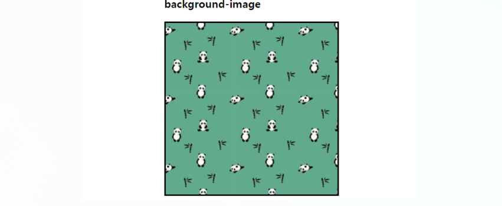

### background-repeat

배경 이미지의 반복 방법을 지정한다.

- **repeat** : 가로, 세로 반복

- **no-repeat** : 반복하지 않음

- **repeat-x** : 가로 반복

- **repeat-y** : 세로 반복

```
<head>
    <style>
        .image_1 {
        background-image: url("img/pandas.jpg");
            /* 가로, 세로 반복 */
            background-repeat: repeat;
            width: 300px;
            height: 300px;
            border: 3px solid black;
            margin-bottom: 40px;
        }
        .image_2 {
            background-image: url("img/pandas.jpg");
            /* 반복하지 않겠다는 표현 */
            background-repeat: no-repeat;
            width: 300px;
            height: 300px;
            border: 3px solid black;
            margin-bottom: 40px;
        }
        .image_3 {
            background-image: url("img/pandas.jpg");
            /* x축으로만 반복 */
            background-repeat: repeat-x;
            width: 300px;
            height: 300px;
            border: 3px solid black;
            margin-bottom: 40px;
        }
        .image_4 {
            background-image: url("img/pandas.jpg");
            /* y축으로만 반복 */
            background-repeat: repeat-y;
            width: 300px;
            height: 300px;
            border: 3px solid black;
            margin-bottom: 40px;
        }
    </style>
</head>
<body>
    <h3>background-image</h3>
    <div class="image_1"></div>
    <div class="image_2"></div>
    <div class="image_3"></div>
    <div class="image_4"></div>
</body>
```

**background-repeat: repeat;**

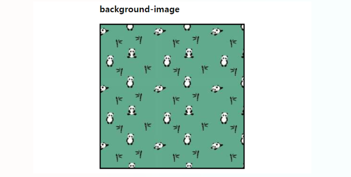

**background-repeat: no-repeat;**

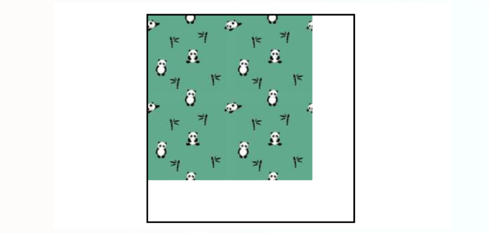

**background-repeat: repeat-x;**

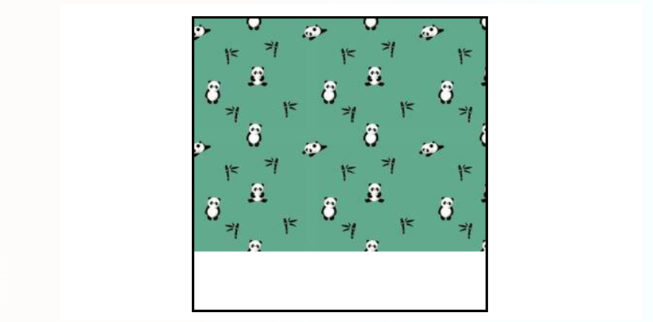

**background-repeat: repeat-y;**

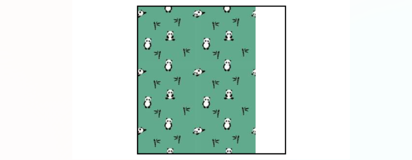

### background-position

**배경 이미지의 초기 위치를 설정**한다.

```
<head>
    <style>
        .image_5 {
            background-image: url("img/pandas.jpg");
            background-repeat: no-repeat;
            background-position-x: right;
            width: 300px;
            height: 300px;
            border: 3px solid black;
            margin-bottom: 40px;
        }
        .image_6 {
            background-image: url("img/pandas.jpg");
            background-repeat: no-repeat;
            background-position-x: left;
            width: 300px;
            height: 300px;
            border: 3px solid black;
            margin-bottom: 40px;
        }
        .image_7 {
            background-image: url("img/pandas.jpg");
            background-repeat: no-repeat;
            background-position-x: center;
            width: 300px;
            height: 300px;
            border: 3px solid black;
            margin-bottom: 40px;
        }
        .image_8 {
            background-image: url("img/pandas.jpg");
            background-repeat: no-repeat;
            background-position-y: center;
            width: 300px;
            height: 300px;
            border: 3px solid black;
            margin-bottom: 40px;
        }
        .image_9 {
            background-image: url("img/pandas.jpg");
            background-repeat: no-repeat;
            background-position-y: top;
            width: 300px;
            height: 300px;
            border: 3px solid black;
            margin-bottom: 40px;
        }
        .image_10 {
            background-image: url("img/pandas.jpg");
            background-repeat: no-repeat;
            background-position-y: bottom;
            width: 300px;
            height: 300px;
            border: 3px solid black;
            margin-bottom: 40px;
        }
    </style>
</head>
<body>
    <h3>background-position</h3>
    <div class="image_5"></div>
    <div class="image_6"></div>
    <div class="image_7"></div>
    <div class="image_8"></div>
    <div class="image_9"></div>
    <div class="image_10"></div>
</body>
```

**background-position-x: right;**

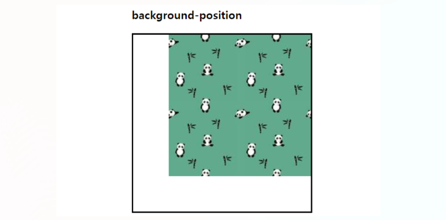

**background-position-x: left;**

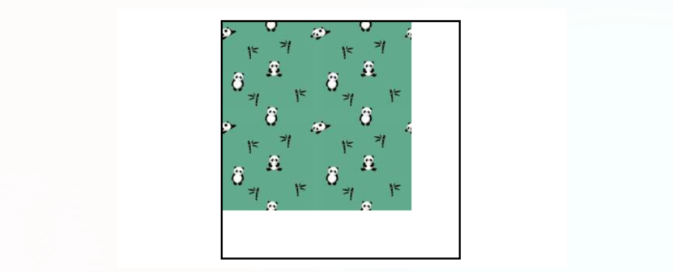

**background-position-x: center;**

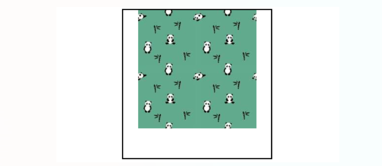

**background-position-y: center;**

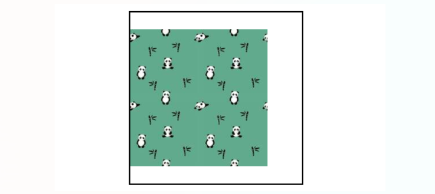

**background-position-y: top;**

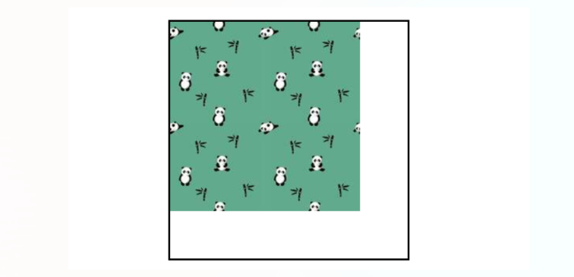

**background-position-y: bottom;**

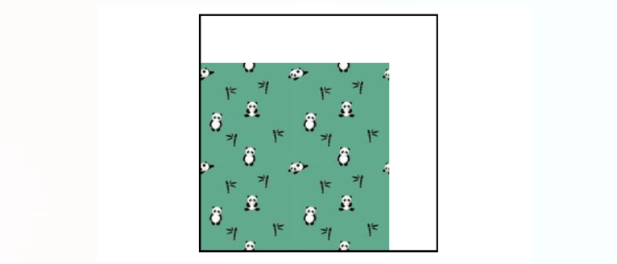

### background-attachment

배경 이미지를 viewport 내에서 고정할지 말지를 지정하는 속성이다.

- **scroll** : 기본값으로 선택한 요소와 함께 움직인다. 내용을 스크롤하면 배경 이미지는 스크롤되지 않는다.

- **fixed** : viewport 스크롤을 해도 이미지는 고정된다.

- **local** : 선택한 요소와 함께 움직인다. 내용을 스크롤하면 배경 이미지도 스크롤된다.

- **initial** : 기본값으로 설정한다.

- **ingerit** : 부모 요소의 속성값을 상속받는다.

**overflow: scroll;** 은 내용이 넘쳐 흘렀을 때 scroll을 한다는 의미이다.

```
<head>
    <style>
        .image {
            background-image: url("img/pandas.jpg");
            background-repeat: repeat;
            background-position: top right;
            width: 200px;
            height: 400px;
            border: 1px solid black;
            display: inline-block;
            overflow: scroll;
        }
        .attachment-scroll {
            background-attachment: scroll;
        }
        .attachment-fixed {
            background-attachment: fixed;
        }
        .attachment-local {
            background-attachment: local;
        }
    </style>
</head>
<body>
    <h3>background-attachment
    <div class="image attachment-scroll">Lorem*8</div>
    <div class="image attachment-fixed">Lorem*8</div>
    <div class="image attachment-local">Lorem*8</div>
</body>
```

### background

`background-image`, `background-repeat`, `background-position`, `background-attachment` 속성을 한꺼번에 선언할 수 있다.

```
background: url("img/pandas.jpg") no-repeat top right fixed;
```

### background-size

**배경 이미지의 크기를 설정**한다.

- **contain** : 이미지가 잘리거나 찌그러지지 않는 한도 내에서 제일 크게 설정

- **cover** : 이미지가 찌그러지지 않는 한도 내에서 제일 크게 설정. 이미지의 가로와 세로 비가 요소와 다르다면 이미지를 세로 또는 가로 방향으로 잘라내어 빈 공간이 생기지 않도록 설정한다. **(주로 현업에서 많이 사용)**

- **auto** : 배경 이미지의 원본 크기를 유지한다.

- **`<length>`** : 원본 크기의 너비/높이를 주어진 값으로 늘리거나 줄임. 음수는 유효하지 않음.

- **`<percentage>`** : 배경 위치 지정 영역의 지정된 백분율에 해당하는 크기로 이미지를 늘린다.

```
<head>
    <style>
        .background-size {
            width: 300px;
            height: 300px;
            background-image: url("img/sports.jpg");
            background-repeat: no-repeat;
            background-size: cover;
            background-position: center;
            border: 2px solid black;
        }
    </style>
</head>
<body>
    <div>
        <h3>background-size</h3>
        <div class="background-size"></div>
    </div>
</body>
```

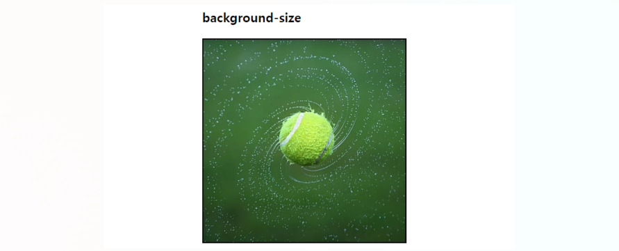

## 2. 그라데이션

### 선형 그라데이션

**`linear-gradient()` 함수는 두 개 이상의 색상이 직선을 따라 점진적으로 변화하는 것**을 말한다.

```
<head>
    <style>
        .linear-gradient {
            width: 500px;
            height: 200px;
            border: 1px solid red;
            background: linear-gradient(to right, red, blue);
        }
    </style>
</head>
<body>
    <h3>linear-gradient</h3>
    <div class="linear-gradient"></div>
</body>
```

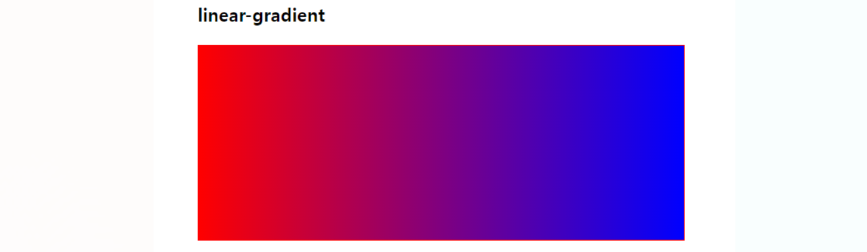

- **top에서 bottom으로 그라데이션**

    `background: linear-gradient(red, blue);`

- **왼쪽에서 오른쪽으로 그라데이션**

    `background: linear-gradient(to right, red, blue);`

- **아래에서 위로 그라데이션**

    `background: linear-gradient(to top, red, blue);`

- **사선으로 그라데이션**

    `background: linear-gradient(to top right, red, blue);`

- **각도 표현**

    `background: linear-gradient(45deg, red, blue);`

- **% 표현 가능**

    `background: linear-gradient(to right, red 50%, blue 80%, yellow 100%)`

### 원형 그라데이션

**타원형**

- `radial-gradient()` 함수를 사용하여 타원형 그라데이션을 만들 수 있다.

```
<head>
    <style>
        .radial-gradient {
            width: 500px;
            height: 200px;
            border: 1px solid blue;
            background: radial-gradient(white, blue, red);
        }
    </style>
</head>
<body>
    <h3>radial-gradient</h3>
    <div class="radial-gradient"></div>
</body>
```

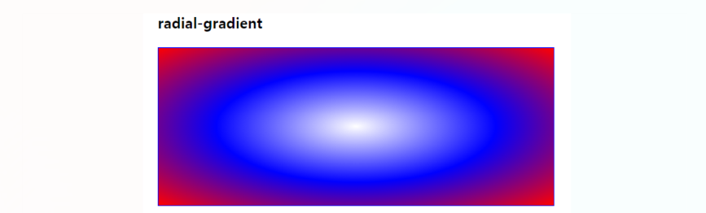

**정원**

- `radial-gradient(circle)` 함수를 사용하여 타원형 그라데이션을 만들 수 있다.

```
<head>
    <style>
        .radial-gradient {
            width: 500px;
            height: 200px;
            border: 1px solid blue;
            background: radial-gradient(circle at 10% 50%, white, yellow, red, blue);
        }
    </style>
</head>
<body>
    <h3>radial-gradient</h3>
    <div class="radial-gradient"></div>
</body>
```

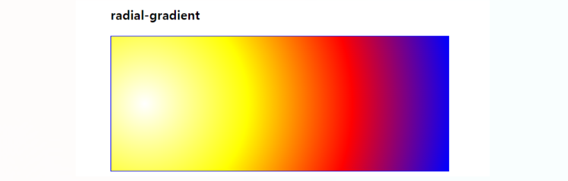