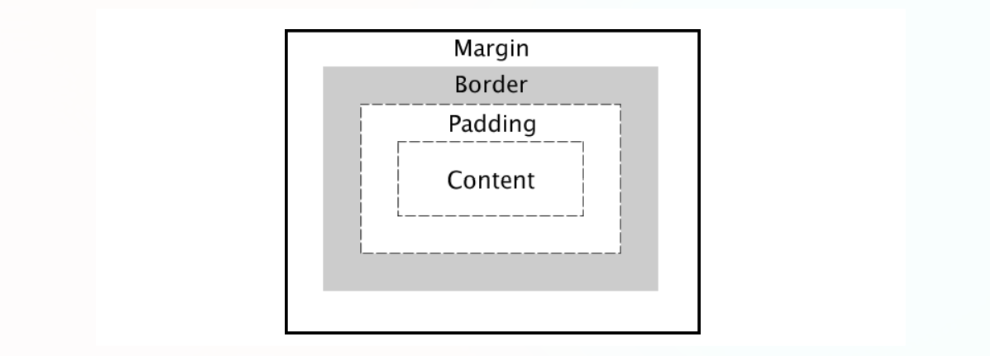
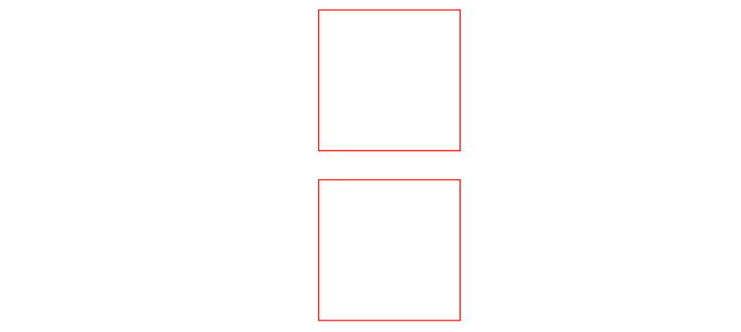
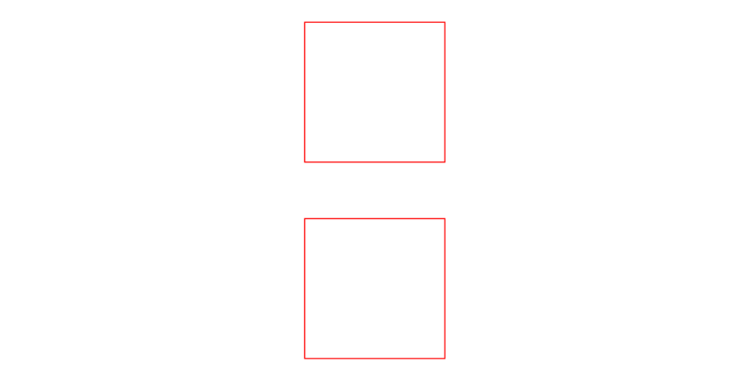

# Box Model

## 1. Box Model이란?

**웹 페이지에서 모든 HTML 요소가 차지하는 일정 공간을 의미한다.**

HTML 요소의 박스 모델은 **`Content`**, **`Padding`**, **`Border`**, **`Margin`** 으로 구성되어 있다.



- **Content** : HTML 요소 내에 존재하는 내용

- **Padding** : 안쪽 여백

- **Border** : HTML 요소를 감싸는 테두리

- **Margin** : HTML 요소의 바깥쪽 여백

### Content

- **width** : 가로 너비를 지정

- **height** : 세로 너비를 지정

- 단위 : `px`, `%`, `viewport` 등 가능

> 인라인 레벨 요소에는 **width, height**가 적용되지 않는다. 왜냐하면 인라인 요소는 콘텐츠 만큼의 영역을 갖기 때문이다.
>
> 만일 인라인 요소에 **width, height**를 변경하고자 하면 **`display: inline-block`** 으로 변경해야 한다.
>
> `inline-vlock` : block과 inline의 중간 형태로 요소는 inline인데 내부는 block처럼 표시한다.

- 인라인 요소 대표 태그 : **`<span>`**

**width, height 적용되지 않은 경우**

```
<head>
    <style>
        span {
            border: 1px solid red;
            width: 100px;
            height: 100px;
        }
    </style>
</head>
<body>
    <span>Content</span>
</body>
```


**width, height 적용되는 경우**

```
<head>
    <style>
        span {
            border: 1px solid red;
            width: 100px;
            height: 100px;
            display: inline-block;
        }
    </style>
</head>
<body>
    <span>Content</span>
</body>
```


### Padding

- **`padding-top`**, **`padding-bottom`**, **`padding-left`**, **`padding-right`** 속성을 사용하여 각각 지정할 수 있다.

- 현업에서는 padding을 3개로 표현하지 않는다.

```
padding: 10px;
/* 상하 좌우 */
padding: 10px 20px;
/* 위 좌우 아래 */
padding: 10px 5px 20px;
/* 위 오른쪽 아래 왼쪽 */
padding: 4px 6px 6px 4px;
padding-top: 20px;
```

### Margin

- **`margin-top`**, **`margin-bottom`**, **`margin-left`**, **`margin-right`** 속성을 사용하여 각각 지정할 수 있다.

**마진 중첩**

- HTML 요소를 세로로 배치할 경우, `margin`과 `margin`이 만날 때 **`margin` 값이 큰 쪽으로 겹쳐지는 것**을 의미한다.

```
<head>
    <style>
        .shape {
            border: 1px solid red;
            width: 100px;
            height: 100px;
            margin: 20px;
        }
    </style>
</head>
<body>
    <div class="shape"></div>
    <div class="shape"></div>
</body>
```



위는 마진 중첩 현상으로 인해 margin이 20px이다.

```
<head>
    <style>
        .shape {
            border: 1px solid red;
            width: 100px;
            height: 100px;
            margin: 20px;
        }
    </style>
</head>
<body>
    <div class="shape" style="margin-bottom: 40px"></div>
    <div class="shape"></div>
</body>
```



위는 우선순위로 인해 margin이 40px이다.

### Border

- CSS 속성으로 **`border`**, **`border-width`**, **`border-style`**, **`border-color`** 가 있다.

**`border-style`**

- **어떤 형태의 테두리 스타일을 지정할지 나타낸다.**

```
border-style: solid;
/* 위 오른쪽 아래 왼쪽 */
border-stlye: solid dotted dashed solid;
border-left-style: solid;
```


**`border-width`**

- **테두리의 두께를 지정한다.**

- 값으로 `<크기>` 또는 키워드 `thin`, `medium`, `thick`이 가능하다.

```
border-width: 1px;
/* 상하 좌우 */
border-width: thin thin;
/* 이 경우는 잘 사용하지 않음 */
border-width: thin medium thick;
/* 위 오른쪽 아래 왼쪽 */
border-width: 3px 5px 5px 3px;
border-left-width: 6px;
```


**`border-color`**

- **테두리 색상을 지정한다.**

```
border-coor: blue;
/* 상하 좌우 */
border-color: yellow red;
```


**`border`**

- `border-width`, `border-style`, `border-color`를 한꺼번에 사용할 수 있는 **단축 속성**이다.

```
/* 두께 스타일 색 */
border: 3px solid yellow;
border: 2px dashed red;
```


**`border-radius`**

- **테두리 꼭짓점을 둥글게 만든다.**

- 원형처럼 만들고자 할 때는 **`border-radius: 50%;`** 를 사용한다.

```
border-radius: 20px;
border-radius: 10% 20%;
```


## 2. Box Sizing

Box Sizing 속성은 **HTML 요소의 너비와 높이를 계산하는 방법**을 지정한다.

### Box-Sizing 값

- **content-box**

    - `width와 height의 값 100` + `padding 값 40 (20+20)` + `border 값 20 (10+10)` => 즉, 한 변의 길이가 160px

    - **`border 크기` + `padding 크기` + `기본 content 크기(width & height)` + `padding 크기` + `border 크기` = 한 변의 길이**

```
<head>
    <style>
        .content-box {
            width: 100px;
            height: 100px;
            border: 10px solid red;
            padding: 10px;
            box-sizing: content-box;
        }
    </style>
</head>
<body>
    <div class="content-box"></div>
</body>
```

- **border-box**

    - 한 변의 길이가 100px

    -**`border 크기` + `padding 크기` + `기본 content 크기` + `padding 크기` + `border 크기` = 한 변의 길이 (100px)**

```
<head>
    <style>
        .border-box {
            width: 100px;
            height: 100px;
            border: 10px solid blue;
            padding: 10px;
            box-sizing: border-box;
        }
    </style>
</head>
<body>
    <div class="border-box"></div>
</body>
```


**Box Sizing을 `border-box` 로 하면 HTML 크기를 정확히 알 수 있다.**

> `viewport` 가 500px일 때 HTML 태그 100px 5개를 선언하고자 하면 `border-box` 로 하게 되면 `width: 100px;` 로 가능하다.