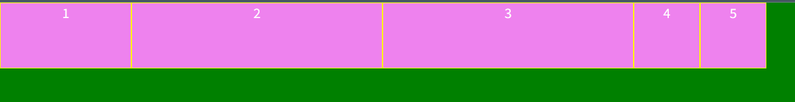
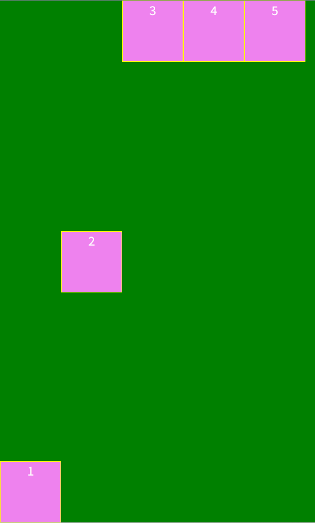

# Flexbox

## 7. flex item 속성

자식 요소의 크기나 순서에 관련된 속성은 flex item에 정의한다.

- **order**

- **flex-grow**

- **flex-shrink**

- **flex-basis**

- **flex**

- **align-self**

**order** (자주 사용하지 않는 속성)

flex item의 배치 순서를 지정한다.

```
.item1 {
    order: 2;
}
.item2 {
    order: 3;
}
.item3 {
    order: 4;
}
.item4 {
    order: 1;
}
.item5 {
    order: 0;
}
```


**flex-grow**

flex item의 너비에 대한 확대 인자를 지정한다. 기본값은 0이고 음수값은 무효하다.

모든 flex item이 동일한 flex-grow 속성값을 가지면 모든 flex item은 동일한 너비를 갖는다.

```
.item1 {
    flex-grow: 2;
}
.item2 {
    flex-grow: 1;
}
.item3 {
    flex-grow: 1;
}
.item4 {
    flex-grow: 1;
}
.item5 {
    flex-grow: 1;
}
```


**flex-shrink**

flex item의 너비에 대한 축소 인자를 지정한다. 기본값은 1고 음수값은 무효하다.

0으로 지정하면 축소가 해제되어 원래 너비를 유지한다.

```
.item1 {
    flex-grow: 2;
    flex-shrink: 2;
}
.item2 {
    flex-grow: 1;
    flex-shrink: 1;
}
.item3 {
    flex-grow: 1;
    flex-shrink: 1;
}
.item4 {
    flex-grow: 1;
    flex-shrink: 1;
}
.item5 {
    flex-grow: 1;
    flex-shrink: 1;
}
```

<video controls src="20251219-1437-08.7551641.mp4" title="Title"></video>

**flex-basis**

flex item의 너비 기본값은 px, % 등의 단위로 지정한다. 기본값은 auto이다.

```
.item1 {
    flex-basis: 160px;
}
.item2 {
    flex-basis: 20%;
}
.item3 {
    flex-basis: 20vw;
}
.item4 {
}
.item5 {
}
```



**flex**

flex-grow, flex-shrink, flex-basis의 단축속성이다. 기본값은 0 1 auto이다.

```
.item1 {
    flex: 2 2 auto;
}
.item2 {
    flex: 1 1 auto;
}
.item3 {
    flex: 1 1 auto;
}
.item4 {
    flex: 1 1 auto;
}
.item5 {
    flex: 1 1 auto;
}
```


**align-self**

개별적으로 수직 방향으로 정렬한다.

```
.item1 {
    align-self: flex-end;
}
.item2 {
    align-self: center;
}
.item3 {
}
.item4 {
}
.item5 {
}
```

