# Flexbox

## 1. flexbox란?

**HTML 요소를 배치, 정렬, 분산할 수 있는 방법을 제공하는 CSS3의 새로운 레이아웃 방식이다.**

**장점 : 복잡한 계산 없이 요소의 크기와 순서를 유연하게 배치할 수 있다.**

## 2. flexbox 구성

우리가 배치하고 싶은 HTML 요소인 `flex item`과 이것을 감싸고 있는 상위 부모 요소인 `flex container`로 구성된다.

- **`flex container` : flex item을 감싸고 있는 부모 요소**

- **`flex item` : flex container 안에 있는 여러 개의 자식 요소**

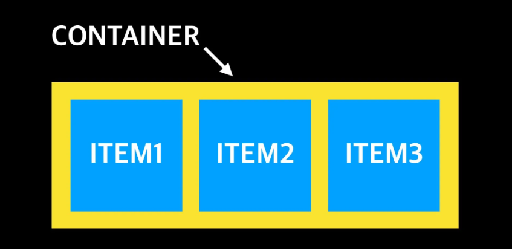

## 3. flexbox 만들기

정렬하려는 요소(flex item)의 부모 요소(flex container)에 `display: flex` 속성을 지정하면 된다.

```
<head>
    <style>
        * {
            margin: 0;
            padding: 0;
        }
        .flex-container {
            background-color: green;
            height: 100vh;
            display: flex;
        }
        .flex-item {
            color: white;
            width: 60px;
            height: 60px;
            background-color: grey;
            text-align: center;
            border: 1px solid yellow;
        }
    </style>
</head>
<body>
    <div class="flex-container">
        <div class="flex-item">1</div>
        <div class="flex-item">2</div>
        <div class="flex-item">3</div>
        <div class="flex-item">4</div>
        <div class="flex-item">5</div>
    </div>
</body>
```

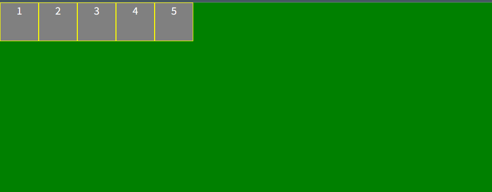

## 4. flexbox 주축

주축의 방향은 flex container의 `flex-direction` 속성으로 결정된다.

**`flex-direction` 속성의 default 값은 row이다.**

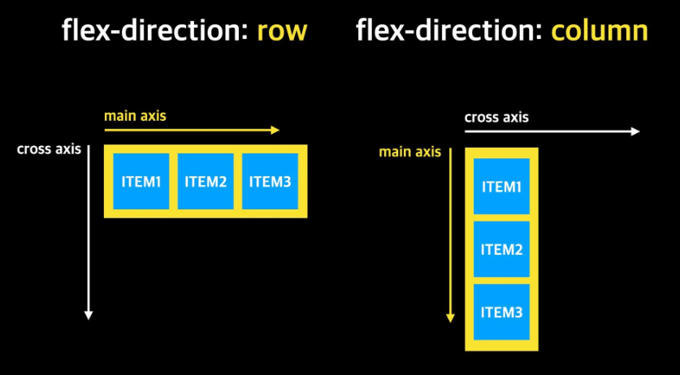

```
.flex-container {
    flex-direction: column;
}
```

## 5. flexbox 속성

### flex container

전체적인 정렬이나 흐름에 관련된 속성은 flex container에 정의한다.

- `display`

- `flex-direction`

- `flex-wrap`

- `flex-flow`

- `justify-content`

- `align-items`

- `align-content`

### flex item

자식 요소의 크기나 순서에 관련된 속성은 flex item에 정의한다.

- `flex`

- `flex-grow`

- `flex-shrink`

- `flex-basis`

- `order`

- `align-self`

## 6. flex container 속성

### flex-direction

flex-direction 속성은 flex container의 주축 방향을 설정한다.

- **row** : 좌에서 우로 수평 배치된다. (Default 값)

- **row-reverse** : 우에서 좌로 수평 배치된다.

- **column** : 위에서 아래로 수직 배치된다.

- **column-reverse** : 아래에서 위로 수직 배치된다.

### flex-wrap

flex item이 여러 개인 경우, 한 줄로 배치할지 여러 줄로 배치할지 결정한다.

- **nowrap** : flex item을 개행하지 않고 1행에 배치한다. 각 flex item의 폭은 flex container에 들어갈 수 있는 크기로 축소된다. (Default 값)

- **wrap** : flex item을 개행하여 배치한다.

- **wrap-reverse** : flex item을 개행하여 reverse하게 배치한다.

### nowrap

```
<head>
    <style>
        * {
            margin: 0;
            padding: 0;
        }
        .flex-container {
            background-color: green;
            height: 100vh;
            display: flex;
            flex-direction: row;
        }
        .flex-item {
            color: white;
            width: 60px;
            height: 60px;
            background-color: grey;
            text-align: center;
            border: 1px solid yellow;
        }
    </style>
</head>
<body>
    <div class="flex-container">
        <div class="flex-item">1</div>
        <div class="flex-item">2</div>
        <div class="flex-item">3</div>
        <div class="flex-item">4</div>
        <div class="flex-item">5</div>
        <div class="flex-item">6</div>
        <div class="flex-item">7</div>
        <div class="flex-item">8</div>
        <div class="flex-item">9</div>
        <div class="flex-item">10</div>
        <div class="flex-item">11</div>
        <div class="flex-item">12</div>
        <div class="flex-item">13</div>
        <div class="flex-item">14</div>
        <div class="flex-item">15</div>
    </div>
</body>
```

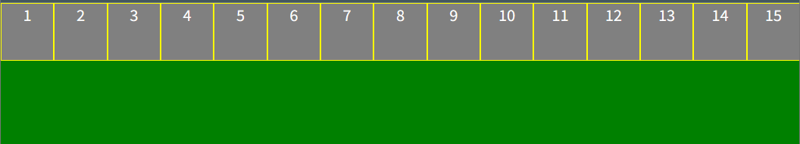

### wrap

```
<head>
    <style>
        * {
            margin: 0;
            padding: 0;
        }
        .flex-container {
            background-color: green;
            height: 100vh;
            display: flex;
            flex-direction: row;
            flex-wrap: wrap;
        }
        .flex-item {
            color: white;
            width: 60px;
            height: 60px;
            background-color: grey;
            text-align: center;
            border: 1px solid yellow;
        }
    </style>
</head>
<body>
    <div class="flex-container">
        <div class="flex-item">1</div>
        <div class="flex-item">2</div>
        <div class="flex-item">3</div>
        <div class="flex-item">4</div>
        <div class="flex-item">5</div>
        <div class="flex-item">6</div>
        <div class="flex-item">7</div>
        <div class="flex-item">8</div>
        <div class="flex-item">9</div>
        <div class="flex-item">10</div>
        <div class="flex-item">11</div>
        <div class="flex-item">12</div>
        <div class="flex-item">13</div>
        <div class="flex-item">14</div>
        <div class="flex-item">15</div>
    </div>
</body>
```

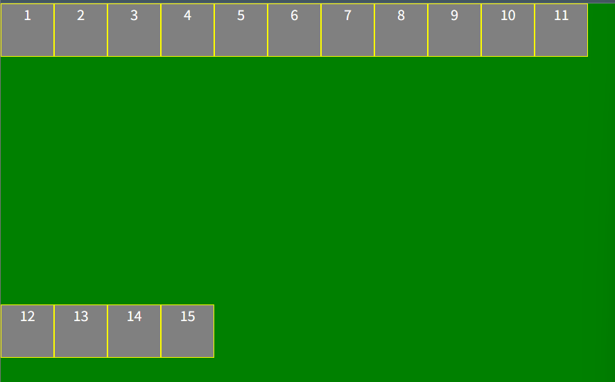

### flex-flow

flex-direction 속성과 flex-wrap 속성을 설정하기 위한 단축 속성이다. 기본값은 row nowrap이다.

```
<head>
    <style>
        * {
            margin: 0;
            padding: 0;
        }
        .flex-container {
            background-color: green;
            height: 100vh;
            display: flex;
            flex-flow: row wrap;
        }
        .flex-item {
            color: white;
            width: 60px;
            height: 60px;
            background-color: grey;
            text-align: center;
            border: 1px solid yellow;
        }
    </style>
</head>
<body>
    <div class="flex-container">
        <div class="flex-item">1</div>
        <div class="flex-item">2</div>
        <div class="flex-item">3</div>
        <div class="flex-item">4</div>
        <div class="flex-item">5</div>
        <div class="flex-item">6</div>
        <div class="flex-item">7</div>
        <div class="flex-item">8</div>
        <div class="flex-item">9</div>
        <div class="flex-item">10</div>
        <div class="flex-item">11</div>
        <div class="flex-item">12</div>
        <div class="flex-item">13</div>
        <div class="flex-item">14</div>
        <div class="flex-item">15</div>
    </div>
</body>
```

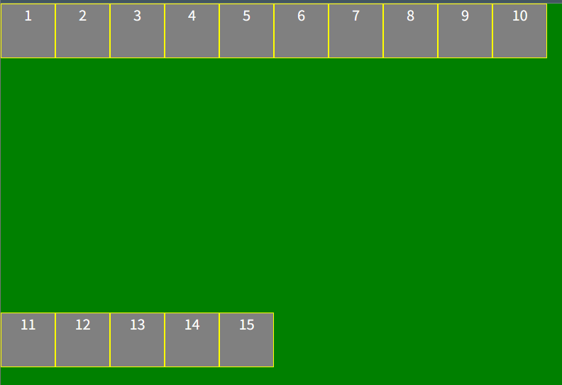

### justify-content

메인축(main axis)을 기준으로 flex item을 수평 정렬한다.

- **flex-start** : 좌측을 기준으로 정렬한다. (Default 값)

- **flex-end** : 우측을 기준으로 정렬한다.

- **center** : flex container의 중앙에 정렬한다.

- **space-between** : 첫번째와 마지막 flex item은 좌우 측면에 정렬되고 나머지 flex item은 균등한 간격으로 정렬된다.

- **space-around** : 모든 flex item은 균등한 간격으로 정렬된다.

**flex-start**

```
.flex-container {
    justify-content: flex-start;
}
```

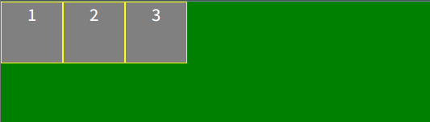

**flex-end**

```
.flex-container {
    justify-content: flex-end;
}
```

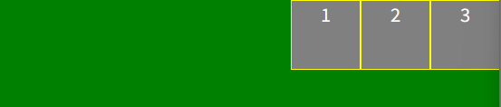

**center**

```
.flex-container {
    justify-content: center;
}
```

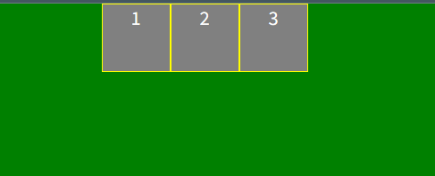

**space-around**

```
.flex-container {
    justify-content: space-around;
}
```

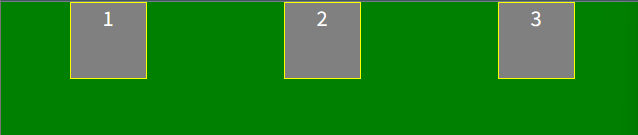

**space-between**

```
.flex-container {
    justify-content: space-between;
}
```

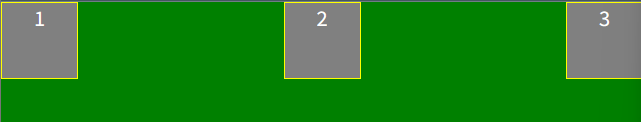

### align-content

교차축(cross axis)을 기준으로 flex item을 수직 정렬한다.

**flex-direction이 row일 때 => justify-content는 수평 정렬 & align-content는 수직 정렬**

- **stretch** : 모든 flex item은 flex item의 행 이후에 균등하게 분배된 공간에 정렬되어 배치된다. (Default 값)

- **flex-start** : 모든 flex item은 flex container의 cross start 기준으로 stack 정렬된다.

- **flex-end** : 모든 flex item은 flex container의 cross end 기준으로 stack 정렬된다.

- **center** : 모든 flex item은 flex container의 cross axis의 중앙에 stack 정렬된다.

- **space-around** : 모든 flex item은 균등 분할된 공간 내에 배치 정렬된다.

**flex-start**

```
.flex-container {
    align-content: flex-start;
}
```

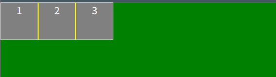

**flex-end**

```
.flex-container {
    align-content: flex-end;
}
```

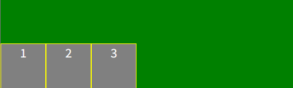

**center**

```
.flex-container {
    align-content: center;
}
```

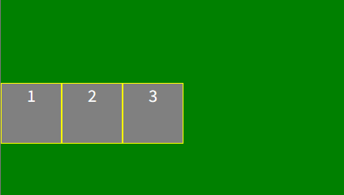

**space-between**

```
.flex-container {
    align-content: space-between;
}
```

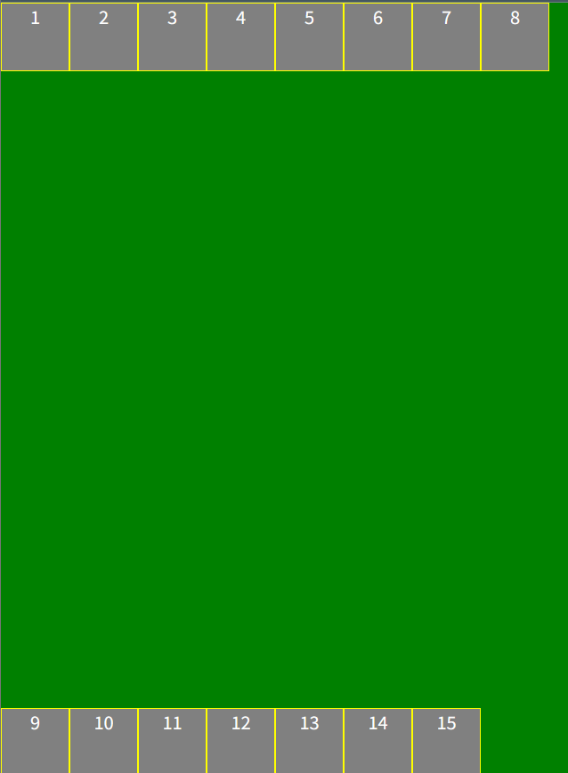

**space-around**

```
.flex-container {
    align-content: space-around;
}
```

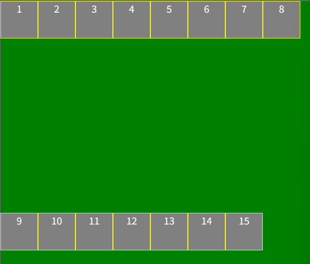

### align-items

flex item을 flex container의 수직 방향(cross axis)으로 정렬한다. align-items 속성은 모든 flex item에 적용된다.

- **stretch** : 모든 flex item은 flex container의 높이에 꽉찬 높이를 갖는다. (Default 값)

- **flex-start** : 모든 flex item은 flex container의 cross start 기준으로 정렬한다.

- **flex-end** : 모든 flex item은 flex container의 cross end 기준으로 정렬된다.

- **center** : 모든 flex item은 flex container의 cross axis의 중앙에 정렬된다.

- **baseline** : 모든 flex item은 flex container의 baseline을 기준으로 정렬된다.

**stretch**

```
.flex-container {
    align-items : stretch
}
```

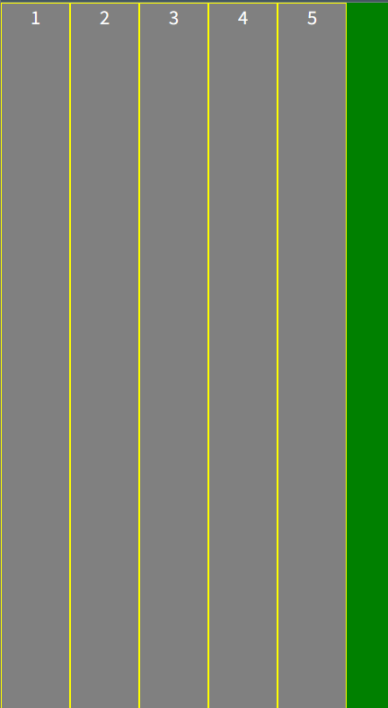

**flex-start**

```
.flex-container {
    align-items : flex-start;
}
```


**flex-end**

```
.flex-container {
    align-items : flex-end;
}
```

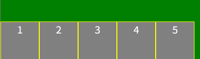

**center**

```
.flex-container {
    align-items : center;
}
```

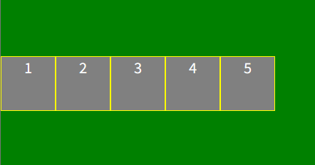

> align-items는 flex line을 기준으로 정렬하는 반면, align-content는 flex line을 정렬한다.