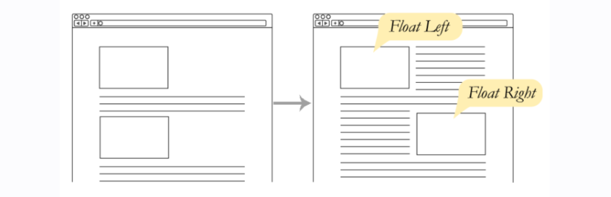
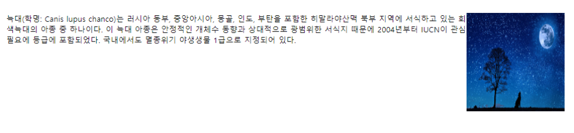

# Float

## 1. Float 속성

**float**의 사전적 의미는 **뜨다**라는 의미이다.

- HTML 요소에 `float`이 적용되면 **HTML 요소는 원래의 흐름에서 벗어나 둥둥 떠다니듯 배치가 된다.**

- 인접한 텍스트 또는 인라인 요소가 그 주위를 자연스럽게 감싸게 한다.



### float 속성 값

- **`none`** : 기본 값으로 요소를 띄우지 않음

- **`left`** : 왼쪽에 띄움

- **`right`** : 오른쪽에 띄움

- **`inherit`** : 부모 요소로부터 상속함

- **`initial`** : 기본값으로 설정함

```
<head>
    <style>
        .float-left {
            float: left;
        }
        .float-right {
            float: right;
        }
    </style>
</head>
<body>
    
    <p>
        숲은 수풀의 준말로 '나무가 빽빽하게 우거진 곳'을 뜻하나, 일반적으로는 '수풀'보다 '숲'이 훨씬 널리 쓰인다. 한자어로는 삼림(森林)이라 하며 특히 빽빽한 숲은 밀림(密林)이라 한다. 영어로는 '포레스트(forest)', '우드(wood)'또는 grove라 한다.
    </p>
    
    <p>
        늑대(학명: Canis lupus chanco)는 러시아 동부, 중앙아시아, 몽골, 인도, 부탄을 포함한 히말라야산맥 북부 지역에 서식하고 있는 회색늑대의 아종 중 하나이다. 이 늑대 아종은 안정적인 개체수 동향과 상대적으로 광범위한 서식지 때문에 2004년부터 IUCN이 관심 필요에 등급에 포함되었다. 국내에서도 멸종위기 야생생물 1급으로 지정되어 있다.
    </p>
</body>
```



## 2. clear 속성

**clear**는 **취소하다**라는 뜻으로 `float: left;` 혹은 `float: right;` 값을 취소한다.

- **`clear: none;` : 기본값**

- **`clear: left;` : 왼쪽을 취소함**

- **`clear: right;` : 오른쪽을 취소함**

- **`clear: both;` : 둘 다 취소함**

```
<head>
    <style>
        .float-left {
            float: left;
        }
        .clear {
        /* clear: left;도 가능 */
            clear: both;
        }
    </style>
</head>
<body>
    
    <p>
        숲은 수풀의 준말로 '나무가 빽빽하게 우거진 곳'을 뜻하나, 일반적으로는 '수풀'보다 '숲'이 훨씬 널리 쓰인다. 한자어로는 삼림(森林)이라 하며 특히 빽빽한 숲은 밀림(密林)이라 한다. 영어로는 '포레스트(forest)', '우드(wood)'또는 grove라 한다.
    </p>
    <p class="clear">
        숲은 수풀의 준말로 '나무가 빽빽하게 우거진 곳'을 뜻하나, 일반적으로는 '수풀'보다 '숲'이 훨씬 널리 쓰인다. 한자어로는 삼림(森林)이라 하며 특히 빽빽한 숲은 밀림(密林)이라 한다. 영어로는 '포레스트(forest)', '우드(wood)'또는 grove라 한다.
    </p>
</body>
```
