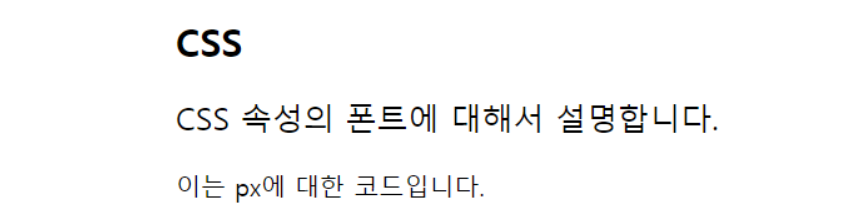
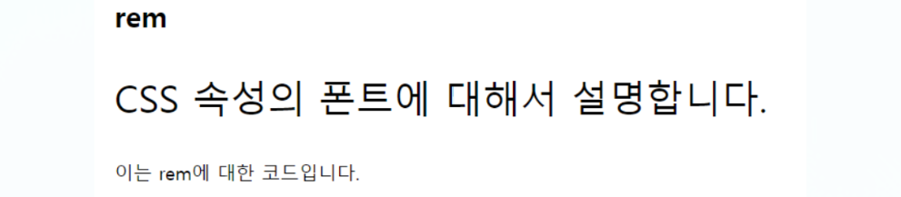
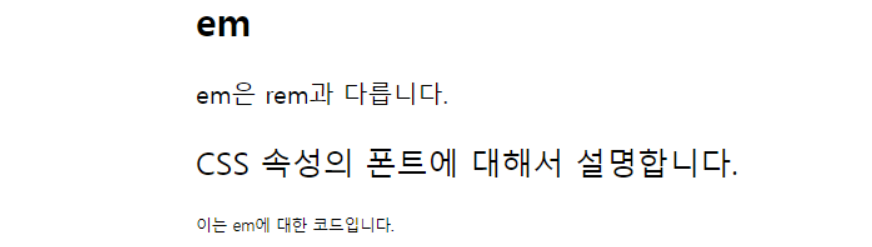
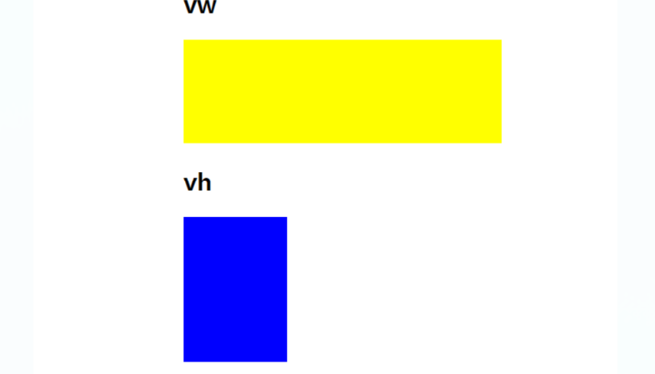
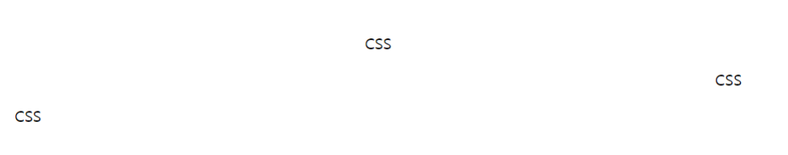
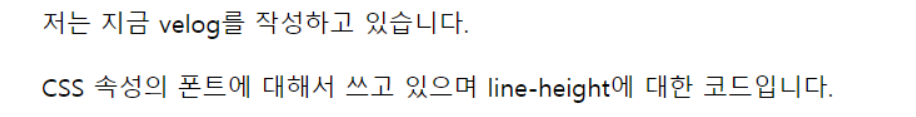
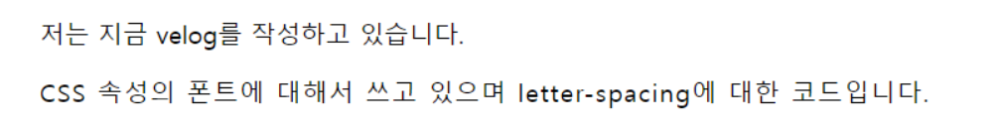
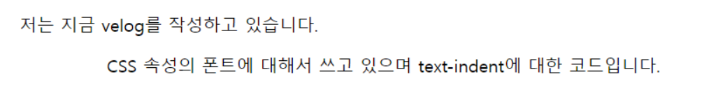
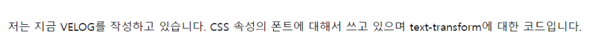
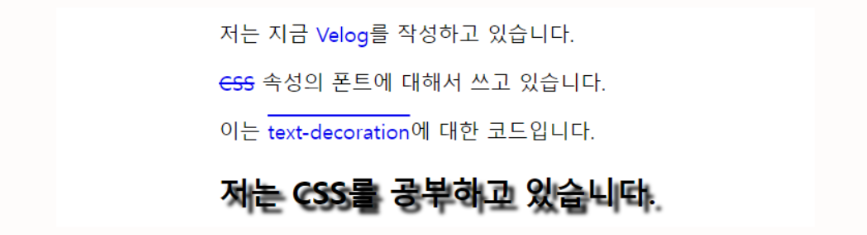

# Font

## 1. 글꼴 관련 속성

### font-family

- **글꼴 종류를 지정**한다.

- 기본 값 : 웹 브라우저 기본 글꼴

```
<head>
    <title>font-family</title>
    <style>
        html {
            font-family: 'Nanum Gothic' , sans-serif;
        }
    </style>
</head>
<body>
    <h2>CSS</h2>
    <p>CSS 속성의 폰트에 대해서 설명합니다.</p>
    <p>이는 font-family에 대한 코드입니다.</p>
</body>
```


### font-size

- **글자 크기를 지정**한다.

```
<head>
    <title>font-size</title>
    <style>
        .title {
            font-size: 28px;
            color: blue;
        }
    </style>
</head>
<body>
    <h2 class="title">CSS</h2>
    <p>CSS 속성의 폰트에 대해서 설명합니다.</p>
    <p>이는 font-size에 대한 코드입니다.</p>
</body>
```


### font-style

- 글자를 **이탤릭체로 표시할지 지정**한다.

```
<head>
    <title>font-style</title>
    <style>
        .font-italic {
            font-style: italic;
        }
    </style>
</head>
<body>
    <h2>CSS</h2>
    <p>CSS 속성의 폰트에 대해서 설명합니다.</p>
    <p class="content font-italic">이는 font-style에 대한 코드입니다.</p>
</body>
```


### font-weight

- **글자 굵기를 지정**한다.

```
<head>
    <title>font-weight</title>
    <style>
        .font-weight-bold {
            font-weight: bold;
        }
        .font-weight-300 {
            font-weight: 300;
        }
    </style>
</head>
<body>
    <h2>CSS</h2>
    <p class="content font-weight-bold">CSS 속성의 폰트에 대해서 설명합니다.</p>
    <p class="content font-weight-300">이는 font-weight에 대한 코드입니다.</p>
</body>
```


### font-variant

- **소문자를 작은 대문자로 바꾸는 속성**이다.

```
<head>
    <title>font-variant</title>
    <style>
        .font-variant {
            font-variant: small-caps;
        }
    </style>
</head>
<body>
    <h2>CSS</h2>
    <p class="content font-variant">Css 속성의 폰트에 대해서 설명합니다.</p>
    <p class="content font-variant">이는 Font-variant에 대한 코드입니다.</p>
</body>
```


## 2. 웹 폰트

온라인의 특정 서버에 위치한 폰트 파일을 다운로드하여 화면에 표시해주는 웹 전용 폰트이다.

- **<a href="https://fonts.google.com/">구글 웹 폰트</a>**

    - 구글 웹 폰트 사이트에 방문하여 `<link>` 또는 `@import` 문을 사용하여 웹 폰트를 적용할 수 있다.

```
<head>
    <title>font-family</title>
    <style>
        @import url('https://fonts.googleapis.com/css2?family=Nanum+Gothic:wght@400;700;800&display=swap');
        html {
            font-family: 'Nanum Gothic' , sans-serif;
        }
    </style>
</head>
<body>
    <h2>CSS</h2>
    <p>CSS 속성의 폰트에 대해서 설명합니다.</p>
    <p>이는 font-family에 대한 코드입니다.</p>
</body>
```

## 3. 글꼴 선택 단위 활용

### px

- **픽셀 단위**

```
<head>
    <title>px</title>
    <style>
        html {
            font-size: 16px;
        }
        .subtitle {
            font-size: 20px;
        }
    </style>
</head>
<body>
    <h2>CSS</h2>
    <p class="subtitle">CSS 속성의 폰트에 대해서 설명합니다.</p>
    <p>이는 px에 대한 코드입니다.</p>
</body>
```



### rem

- 루트 요소의 글꼴 크기

- **최상위 요소의 몇 배로 지정할 것인지**에 대한 것이다.

- `2rem` 은 font-size를 2배만큼 하겠다는 의미이다.

```
<head>
    <title>rem</title>
    <style>
        html {
            font-size: 16px;
        }
        .subtitle-rem {
            font-size: 2rem;
        }
    </style>
</head>
<body>
    <h2>rem</h2>
    <p class="subtitle-rem">CSS 속성의 폰트에 대해서 설명합니다.</p>
    <p>이는 rem에 대한 코드입니다.</p>
</body>
```



### em

- 요소의 글꼴 크기

- 최상위 요소가 아니라 **현재 설정되어 있는 자기 자신의 태그의 몇 배로 지정할 것인지**에 대한 것이다.

- `div` 태그가 10px인데 그 내부에 있는 `subtitle-em` 은 `10 * 2 = 20px` 이다.

```
<head>
    <title>em</title>
    <style>
        html {
            font-size: 16px;
        }
        .subtitle-em {
            font-size: 2em;
        }
        .article {
            font-size: 10px;
        }
    </style>
</head>
<body>
    <h2>em</h2>
    <p>em은 rem과 다릅니다.</p>
    <div class="article">
    <p class="subtitle-em">CSS 속성의 폰트에 대해서 설명합니다.</p>
    <p>이는 em에 대한 코드입니다.</p>
    </div>
</body>
```



### vw

- viewport : 현재 보이는 화면 사이즈

- **viewport 너비의 1%**

### vh

- **viewport 높이의 1%**

```
<head>
    <title>vw/vh</title>
    <style>
        .rectangle.width {
            width: 20vw;
            height: 100px;
            background-color: yellow;
        }
        .rectangle.height {
            height: 20vh;
            width: 100px;
            background-color: blue;
        }
    </style>
</head>
<body>
    <!-- Viewport Width -->
    <h2>vw</h2>
    <div class="rectangle width"></div>
    <!-- Viewport Height -->
    <h2>vh</h2>
    <div class="rectangle height"></div>
</body>
```



## 4. 글자 색상

**color 속성을 지정**

- 색상 값으로는 **색상 이름, 16진수 값, rgb값, hsl값**이 사용된다.

### 색상 키워드 표기법

**대소문자를 구분하지 않는 식별자**이다.

- 예시 : blue, red, yellow 등

- **transparent 키워드**

    - **완전 투명한 색으로 적용된다.**

    - `rgba(0, 0, 0, 0)`

```
.style {
    color: red;
}
```

### RGB/RGBA 표기법

- RGB 색상 모델은 **빨강, 초록, 파랑**을 통해 특정 색을 표현한다.

- 선택사항으로 **색의 투명도를 표현한다.**

- `rgb()` , `rgba()` 로 표기할 수 있다.

- a는 0에 가까워질수록 투명해진다.

```
.style {
    color: rgb(89, 199, 52);
}
.style {
    color: rgba(89, 199, 52, 0.868);
}
```

### 16진수 표기법

- **`#` 뒤에 16진수 표기법으로 표현**할 수 있다.

- 예시 : `#ff0000` , `#ff00ff` 등

    - 1, 2번째 자리: red

    - 3, 4번째 자리: green

    - 5, 6번째 자리: blue

    - 7, 8번째 자리: 투명도 (00으로 갈수록 투명해진다.)

```
.style {
    color: #6c34c7;
}
```

### hsl/hsla 표기법

- HSL 색상 모델은 **색상, 채도, 명도**를 통해 특정 색상을 표현한다.

- 선택사항으로 **색의 투명도를 표현**할 수 있다.

- `hsl()` , `hsla()` 로 표기할 수 있다.

- 예시 : `hsl(H, S, L)` , `hsla(H, S, L, A)`

```
.style {
    color: hsla(102, 61%, 50%, 0.868);
}
```

## 5. 그 외 글자 관련 속성

### text-align

블록 요소, 테이블 셀 박스 안에서 글자를 **가로로 정렬**하는 데 사용한다.

- 키워드 : `start` , `end` , `left` , `right` , `center` , `justify` , `justify-all` , `match-parent`

```
<head>
    <title>text-align</title>
    <style>
        .text-center {
            text-align: center;
        }
        .text-right {
            text-align: right;
        }
        .text-left {
            text-align: left;
        }
    </style>
</head>
<body>
    <section>
        <p class="content text-center">CSS</p>
        <p class="content text-right">CSS</p>
        <p class="content text-left">CSS</p>
    </section>
</body>
```



### line-height

**줄 간격을 설정한다.**

- 줄 높이를 정하는 속성이다.

- 사용자가 읽기 편한 간격 : **자간 < 어간 < 행간** 순으로 넓어야 한다. (이를 염두해두고 디자인하기)

- default : `1.25`

- `1.5` 이상으로 해야 글 읽기가 쉽다.

- `normal` , `2.5` , `3em` , `150%` , `32px` 등 높이 값을 설정할 수 있다.

```
<head>
    <title>line-height</title>
    <style>
        /* 줄간격은 html px의 1.8배 */
        .article {
            line-height: 1.8rem;
        }
    </style>
</head>
<body>
    <section>
        <p>저는 지금 velog를 작성하고 있습니다.</p>
        <p class="article">
      CSS 속성의 폰트에 대해서 쓰고 있으며 line-height에 대한 코드입니다.
        </p>
    </section>
</body>
```



### letter-spacing

**글자 사이의 간격을 설정**한다.

```
<head>
    <title>letter-spacing</title>
    <style>
        .spacing {
            letter-spacing: 1px;
        }
    </style>
</head>
<body>
    <section>
        <p>저는 지금 velog를 작성하고 있습니다.</p>
        <p class="spacing">
      CSS 속성의 폰트에 대해서 쓰고 있으며 letter-spacing에 대한 코드입니다.
        </p>
    </section>
</body>
```



### word-spacing

**단어 사이의 간격, 픽셀 단위나 em으로 조정**한다.

```
<head>
    <title>word-spacing</title>
    <style>
        .word {
            word-spacing: 10px;
        }
    </style>
</head>
<body>
    <section>
        <p>저는 지금 velog를 작성하고 있습니다.</p>
        <p class="word">
      CSS 속성의 폰트에 대해서 쓰고 있으며 word-spacing에 대한 코드입니다.
        </p>
    </section>
</body>
```


### text-indent

**들여쓰기를 설정**한다.

```
<head>
    <title>text-indent</title>
    <style>
        .indent {
            text-indent: 80px;
        }
    </style>
</head>
<body>
    <section>
        <p>저는 지금 velog를 작성하고 있습니다.</p>
        <p class="indent">
      CSS 속성의 폰트에 대해서 쓰고 있으며 text-indent에 대한 코드입니다.
        </p>
    </section>
</body>
```



### text-transform

**대문자로 또는 소문자로 바꾸는 속성**이다.

- **`uppercase` : 모두 대문자로 변경**

- **`lowercase` : 모두 소문자로 변경**

```
<head>
    <title>text-transform</title>
    <style>
        .transform-case {
            text-transform: uppercase;
        }
        .transform-case-1 {
            text-transform: lowercase;
        }
    </style>
</head>
<body>
    <section>
        <p>저는 지금 <span class="transform-case">Velog</span>를 작성하고 있습니다. CSS 속성의 폰트에 대해서 쓰고 있으며 <span class="transform-case-1">Text-Transform</span>에 대한 코드입니다.
        </p>
    </section>
</body>
```



### text-decoration

**글자에 그림자**를 넣을 수 있다.

- 순서 : **가로, 세로, 번짐, 색상**

- ex) `text-shadow: 5px 5px 3px #222;` (black처럼 색 지정 가능)

- `text-decoration: none;` : text 아래 밑줄 없애기

- `text-decoration: line-through;` : text에 취소선

- `text-decoration: overline;` : text 위 쪽에 밑줄 생김

```
<head>
    <title>text-decoration</title>
    <style>
        .text-shadow {
            text-shadow: 5px 5px 3px black;
        }
        .case-1 > a {
            text-decoration: none;
        }
        .case-2 > a {
            text-decoration: line-through;
        }
        .case-3 > a {
            text-decoration: overline;
        }
    </style>
</head>
<body>
    <section>
        <p class="case-1">
            저는 지금 <a href="#">Velog</a>를 작성하고 있습니다.
        </p>
        <p class="case-2">
            <a href="#">CSS</a> 속성의 폰트에 대해서 쓰고 있습니다.
        </p>
        <p class="case-3">
            이는 <a href="#">text-decoration</a>에 대한 코드입니다.
        </p>
    </section>
    <section>
        <h2 class="text-shadow">저는 CSS를 공부하고 있습니다.</h2>
    </section>
</body>
```



### life-style

**리스트 스타일 변경**한다.

- `ul` 태그 내에 있는 `li` 태그의 순서 없는 목록의 표시를 수정하는데 사용한다.

```
<head>
    <title>list-style</title>
    <style>
        ul {
            list-style: circle;
        }
    </style>
</head>
<body>
    <section>
        <ul>
            <li>1</li>
            <li>2</li>
            <li>3</li>
        </ul>
    </section>
</body>
```


### white-space

요소가 **공백 문자를 처리하는 법**을 지정한다.

### word-break

**텍스트가 자신의 콘텐츠 박스 밖으로 오버플로 할 때 줄을 바꿀지 지정한다.**