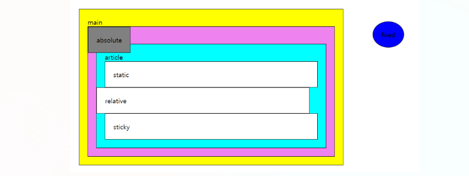

# Position

## 1. Position 속성

HTML 요소를 배치하는 방법을 지정한다.

### static (기본값)

- 요소가 HTML 문서에서 **일반적인 흐름을 따라서 배치된다.**

    - **Inline Element : 좌 -> 우**

    - **Block Element : 위 -> 아래**

- `main`, `section`, `article`, `div` 태그는 position 속성이 **static**이다.

- `top`, `right`, `bottom`, `left`는 **비활성화**되어 있다.

### relative

- 요소가 HTML 문서에서 **일반적인 흐름을 따라서 배치된다.**

- `top`, `right`, `bottom`, `left`와 같은 속성을 사용하여 HTML 요소의 상대적인 위치를 변경할 수 있다.

### absolute

- 요소가 문서의 **일반적인 흐름을 따르지 않는다.**

- **`position: static;` 속성을 가지고 있지 않은 부모를 기준으로 움직인다.**

- 만약 **부모 중에 포지션이 `relative`, `absolute`, `fixed` 태그가 없다면 가장 위의 태그인 `body`가 기준**이 된다.

### fixed

- 요소가 문서의 **일반적인 흐름을 따르지 않는다.**

- **스크롤이 되어도 고정된 자리를 가지게 된다.**

> **viewport란?**
>
> 웹 브라우저가 브라우저 화면 상에서 실제로 표시되는 영역

### sticky

- **HTML 문서 안에서 일반적인 흐름을 따라가다가 스크롤 위치가 임계점에 이르면 `fixed`와 같이 박스를 화면에 고정할 수 있는 속성이다.**

- `right`, `bottom`, `left`와 같은 속성이 사용되지 않고 `top`만 적용된다.

```
<head>
    <style>
        body {
            margin: 0px;
            padding: 0px;
        }
        main, section, article, div {
            border: 1px solid black;
            padding: 20px;
        }
        main {
            max-width: 600px;
            margin: 0 auto;
            background-color: yellow;
        }
        section {
            background-color: violet;
        }
        article {
            background-color: cyan;
        }
        div {
            background-color: white;
        }
        div.relative {
            position: relative;
            right: 20px;
        }
        div.absolute {
            position: absolute;
            background-color: grey;
            top: 0px;
            left: 0px;
        }
        div.fixed {
            position: fixed;
            background-color: red;
            top: 30px;
            right: 300px;
            border-radius: 50%
        }
        div.sticky {
            position: sticky;
            top: 0px;
        }
    </style>
</head>
<body>
    <main>
        main
        <section>
            section
            <article>
                article
                <div>static</div>
                <div class="relative">relative</div>
                <div class="absolute">absolute</div>
                <div class="fixed">fixed</div>
                <div class="sticky">sticky</div>
            </article>
        </section>
    </main>
</body>
```



## 2. z-index

어느 HTML 요소가 앞으로 나올지 뒤에 있을지 **배치 순서를 결정하는 속성**이다.

- position이 **`relative`, `absolute`, `fixed`에만 작동**한다.

- **`z-index: 숫자;`에서 숫자가 높을수록 앞에 배치**된다.

```
<head>
  <style>
    div.relative {
      position: relative;
      top: -100px;
      z-index: 5;
    }
  </style>
</head>
<body>
  <div class="relative">relative</div>
</body>
```