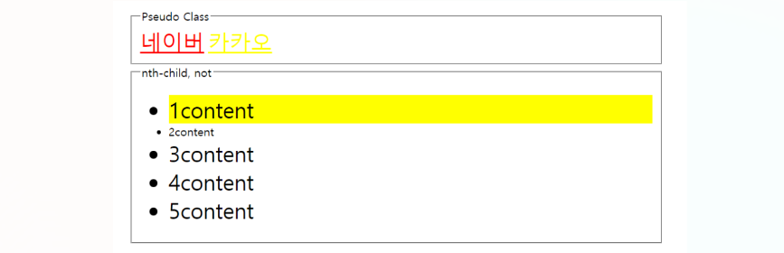
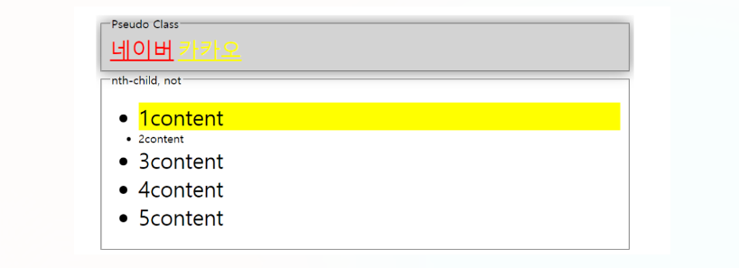
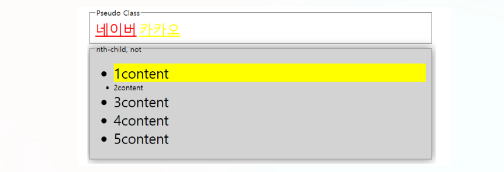
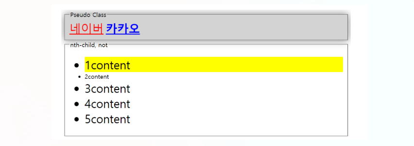
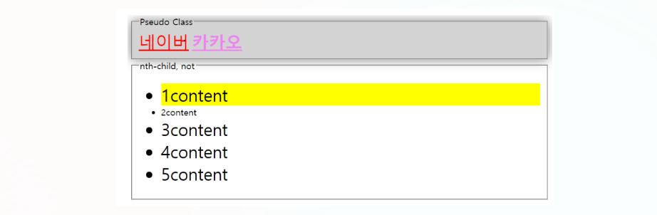
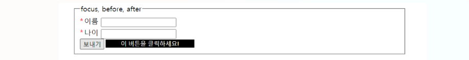
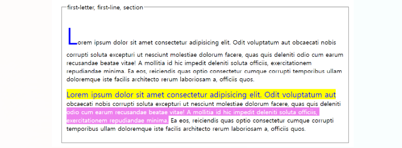

# 가상 클래스 & 가상 요소

## 1. 가상 클래스 (Pseudo class)

가상 클래스 (Pseudo-class)는 **선택하고자 하는 HTML 요소의 특정 상태를 명시할 때 사용한다.**

**`선택자:가상클래스이름 {속성: 속성값;}`**

### 종류

- **`:link`** : 아직 방문하지 않은 요소를 나타낸다.

- **`:visited`** : 사용자가 방문한 적이 있는 링크를 나타낸다.

- **`:active`** : 활성화한 요소를 나타낸다.

- **`:hover`** : 마우스 커서가 요소 위로 올라가 있을 때 선택된다.

- **`:focus`** : 입력 칸에 커서가 포커스 되었을 때 나타낸다.

- **`:nth-child`** : 형제 요소들 사이에서 특정 요소를 선택할 때 나타낸다.

- **`:not(selector)`** : 요소를 제외할 때 나타낸다.

```
<head>
    <style>
        a {
            font-size: 30px;
        }
        a:link {
            color: yellow;
        }
        a:visited {
            color: red;
        }
        a:hover {
            color: blue;
            font-weight: 900;
        }
        fieldset:hover {
            background-color: lightgrey;
            box-shadow: 0 0 20px grey;
        }
        input:focus {
            outline: none;
            border: 3px solid red;
            box-shadow: 0 0 20px rgb(176, 118, 118);
        }
        li:nth-child(1) {
            background-color: yellow;
        }
        li:not(.target) {
            font-size: 30px;
        }
    </style>
</head>
<body>
    <fieldset>
        <legend>Pseudo Class</legend>
        <div>
            <a href="https://naver.com">네이버</a>
            <a href="https://kakao.com">카카오</a>
        </div>
    </fieldset>
    <fieldset>
        <legend>nth-child, not</legend>
        <ul>
        <li>1content</li>
        <li class="target">2content</li>
        <li>3content</li>
        <li>4content</li>
        <li>5content</li>
        </ul>
    </fieldset>
</body>
```

**방문한 적 있는 링크 : red**

**방문한 적 없는 링크 : yellow**

**li의 형제들 중 1번째 요소 : yellow**

**li 중 class가 target인 요소만 font-size가 작아짐**



**마우스 커서가 있는 filedset : lightgrey**

**box 그림자는 번짐 20px에 grey**





**마우스 커서가 있는 a 태그 : blue**

**`font-weight`가 900**



**활성화한 요소 (클릭하고 있는) : violet**



## 2. 가상 요소 (Pseudo element)

**가상 요소는 해당 HTML 요소의 특정 부분만을 선택할 때 사용한다.**

> **툴팁 : 특정 정보를 보여주는 말풍선**

**`선택자::가상요소이름 {속성: 속성값;}`**

### 종류

- **`::first-letter`** : 텍스트의 첫 글자만을 선택한다. 단, 블록 레벨 요소에만 사용할 수 있다.

- **`::first-line`** : 텍스트의 첫 라인만을 선택한다. 단, 블록 레벨 요소에만 사용할 수 있다.

- **`::before`** : 특정 요소 내용 부분 바로 앞에 다른 요소를 삽입할 때 사용한다.

- **`::after`** : 특정 요소 내용 부분 바로 뒤에 다른 요소를 삽입할 때 사용한다.

- **`::selection`** : 사용자가 선택한 부분만을 선택할 때 사용한다.

```
<head>
    <style>
        .required::before {
            content: '*';
            margin-right: 2px;
            color: red;
            font-size: 18px;
        }
        [data-tooltip] {
            position: relative;
        }
        [data-tooltip]:hover::after {
            content: attr(data-tooltip);
            position: absolute;
            top: 0px;
            left: 56px;
            background-color: black;
            color: white;
            width: 200px;
        }
        .letter::first-letter {
            font-size: 60px;
            color: blue;
        }
        .line::first-letter {
            background-color: yellow;
            color: blue;
            font-size: 20px;
        }
        p::selection {
            background-color: violet;
            color: white;
        }
    </style>
</head>
<body>
    <fieldset>
        <legend>focus, before, after</legend>
        <div class="field">
            <label class="required" for="name">이름</label>
            <input type="text" id="name">
        </div>
        <div class="field">
            <label class="required" for="age">나이</label>
            <input type="text" id="age">
        </div>
        <button data-tooltip="이 버튼을 클릭하세요!">보내기</button>
    </fieldset>
    <fieldset>
        <legend>first-letter, first-line, selection</legend>
        <div>
            <p class="letter">
                Lorem ipsum dolor sit amet consectetur adipisicing elit. Odit voluptatum aut obcaecati nobis corrupti soluta excepturi ut nesciunt molestiae dolorum facere, quas quis deleniti odio cum earum recusandae beatae vitae!
                A mollitia id hic impedit deleniti soluta officiis, exercitationem repudiandae minima. Ea eos, reiciendis quas optio consectetur cumque corrupti temporibus ullam doloremque iste facilis architecto rerum laboriosam a, officiis quos.
            </p>
            <p class="line">
                Lorem ipsum dolor sit amet consectetur adipisicing elit. Odit voluptatum aut obcaecati nobis corrupti soluta excepturi ut nesciunt molestiae dolorum facere, quas quis deleniti odio cum earum recusandae beatae vitae!
                A mollitia id hic impedit deleniti soluta officiis, exercitationem repudiandae minima. Ea eos, reiciendis quas optio consectetur cumque corrupti temporibus ullam doloremque iste facilis architecto rerum laboriosam a, officiis quos.
            </p>
        </div>
    </fieldset>
</body>
```

**`label class="required"`인 것들은 `.required::before`을 통해서 `content인 *`를 추가**


**툴팁으로서 툴팁의 `position`을 `relative`로 한 후 이를 기준으로 만들고 위치**

**`data-tooltip`에 내용 입력 -> CSS에서 `attr(data-tooltip);`으로 표현**

`hover`도 적용함으로써 마우스 커서를 올렸을 때 나타나도록 표현



**first-letter을 `color: blue`로 적용하고 글씨를 크게 적용**

**first-line을 `background-color: yellow`로 적용하고 글씨를 `color: blue`로 적용**

**`p::selection`을 통해 `background-color: violet`을 적용하고 `color: white`를 적용 -> 이는 선택할 때 적용**

