# 반응형 웹 사이트

## 1. 반응형 웹 사이트란?

웹 사이트에서 PC화면 뿐만 아니라 모바일, 태블릿, 노트북 등 **여러가지 디바이스의 해상도에 반응하여 각각에 맞는 최적의 화면을 보여주는 홈페이지**이다.

## 2. 뷰포트 (Viewport)

**웹 브라우저에서 실제 내용이 표시되는 영역이다.**

모바일 viewport와 PC의 viewport는 크기가 다르다. 즉, 반응형 웹에서는 viewport에 맞게 화면에 보여주어야 한다.

이러한 경우 사용하는 메타태그는 **뷰포트 메타태그**이다.

> viewport는 개발자 도구 -> Toogle Device Tool Bar에서 확인 가능 

### 뷰포트 선언하지 않은 경우

```
<!DOCTYPE html>
<html lang="en">
<head>
    <meta charset="UTF-8">
    <title>Viewport</title>
    <style>
        body {
            margin: 0;
            padding: 0;
        }
        div {
            background-color: blue;
            width: 180px;
            height: 180px;
        }
    </style>
</head>
<body>
    <h1>안녕하세요</h1>
    <hr>
    <p>
        Lorem ipsum dolor sit amet consectetur adipisicing elit. Corporis, adipisci minus reiciendis quasi magni possimus quos dolores. Sed est illum quas, delectus alias totam harum quasi, atque, corporis tenetur accusamus?
    </p>
    <div></div>
</body>
</html>
```

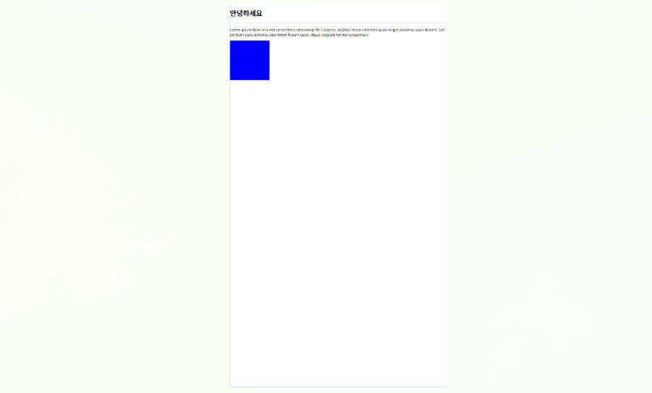

### 뷰포트 선언한 경우

```
<!DOCTYPE html>
<html lang="en">
<head>
    <meta charset="UTF-8">
    <!-- width=device-width임을 인지하자 -->
    <meta name="viewport" content="width=device-width, initial-scale=1.0">
    <title>Viewport</title>
    <style>
        body {
            margin: 0;
            padding: 0;
        }
        div {
            background-color: blue;
            width: 180px;
            height: 180px;
        }
    </style>
</head>
<body>
    <h1>안녕하세요</h1>
    <hr>
    <p>
        Lorem ipsum dolor sit amet consectetur adipisicing elit. Corporis, adipisci minus reiciendis quasi magni possimus quos dolores. Sed est illum quas, delectus alias totam harum quasi, atque, corporis tenetur accusamus?
    </p>
    <div></div>
</body>
</html>
```

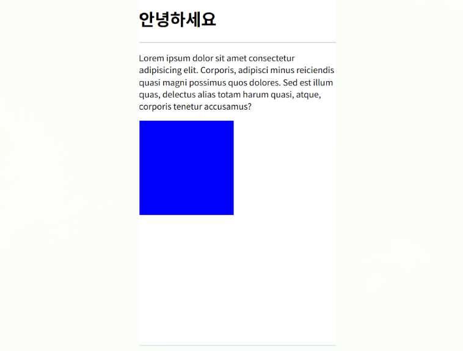

<hr>

### 메타 뷰포트 태그 속성

- **`width`** : 뷰포트 가로

- **`height`** : 뷰포트 세로

- **`user-scalable`** : 사용자 확대/축소 가능 여부

- **`initial-scale`** : 초기 화면 비율

- **`maximum-scale`** : 최대 화면 비율

- **`minimum-scale`** : 최소 화면 비율

<hr>

### user-scalable

default 값이 `yes`이다.

**no로 하고자 하면**

`<meta name="viewport" content="width=device-width, initial-scale=1.0, user-scalable=no">`

<hr>

### initial-scale

default 값이 `initial-scale=1`이다.

**`initial-scale=0.5`로 하면 초기 화면 비율을 50%로 하겠다는 의미이다.**

`<meta name="viewport" content="width=device-width, initial-scale=0.5, user-scalable=no">`

<hr>


<hr>

### maximum-scale, minimum-scale

최대 확대 & 축소할 수 있는 비율

<hr>

### 일반적인 사용법

`<meta name="viewport" content="width=device-width, initial-scale=1">`

### 뷰 포트 단위

- **`vw` (viewport width)** : 1vw는 뷰포트 너비의 1%이다.

    100vw = 뷰포트 너비의 100%

- **`vh` (viewport height)** : 1vh는 뷰포트 높이의 1%이다.

    100vh = 뷰포트 높이의 100%

- **`vmin` (viewport minimum)** : 뷰포트의 너비와 높이 중에서 작은 값의 1%와 같다.

- **`vmax` (viewport maximum)** : 뷰포트의 너비와 높이 중에서 큰 값의 1%와 같다.

<hr>

### vw

```
<!DOCTYPE html>
<html lang="en">
<head>
    <meta charset="UTF-8">
    <meta name="viewport" content="width=device-width, initial-scale=1">
    <title>Viewport</title>
    <style>
        body {
            margin: 0;
            padding: 0;
        }
        div {
            background-color: blue;
            width: 100vw;
            height: 180px;
        }
    </style>
</head>
<body>
    <h1>안녕하세요</h1>
    <hr>
    <p>
        Lorem ipsum dolor sit amet consectetur adipisicing elit. Corporis, adipisci minus reiciendis quasi magni possimus quos dolores. Sed est illum quas, delectus alias totam harum quasi, atque, corporis tenetur accusamus?
    </p>
    <div></div>
</body>
</html>
```

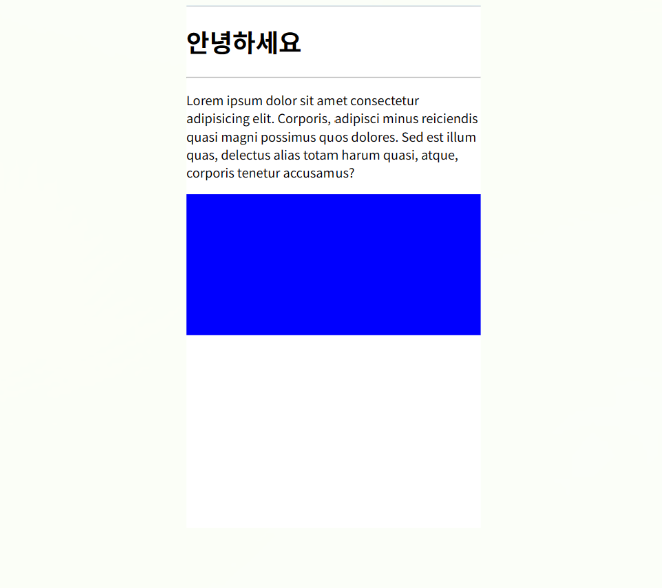

<hr>

### vh

```
<!DOCTYPE html>
<html lang="en">
<head>
    <meta charset="UTF-8">
    <meta name="viewport" content="width=device-width, initial-scale=1">
    <title>Viewport</title>
    <style>
        body {
            margin: 0;
            padding: 0;
        }
        div {
            background-color: blue;
            width: 100px;
            height: 180vh;
        }
    </style>
</head>
<body>
    <h1>안녕하세요</h1>
    <hr>
    <p>
        Lorem ipsum dolor sit amet consectetur adipisicing elit. Corporis, adipisci minus reiciendis quasi magni possimus quos dolores. Sed est illum quas, delectus alias totam harum quasi, atque, corporis tenetur accusamus?
    </p>
    <div></div>
</body>
</html>
```

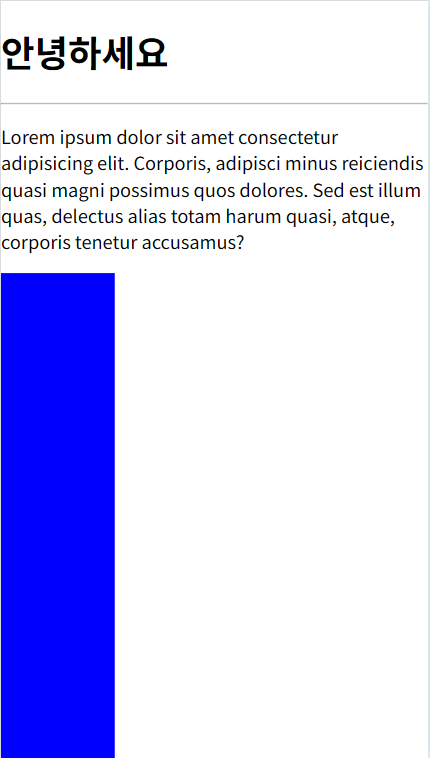

<hr>

### vmin

```
<!DOCTYPE html>
<html lang="en">
<head>
    <meta charset="UTF-8">
    <meta name="viewport" content="width=device-width, initial-scale=1">
    <title>Viewport</title>
    <style>
        body {
            margin: 0;
            padding: 0;
        }
        div {
            background-color: blue;
            width: 50vmin;
            height: 180px;
        }
    </style>
</head>
<body>
    <h1>안녕하세요</h1>
    <hr>
    <p>
        Lorem ipsum dolor sit amet consectetur adipisicing elit. Corporis, adipisci minus reiciendis quasi magni possimus quos dolores. Sed est illum quas, delectus alias totam harum quasi, atque, corporis tenetur accusamus?
    </p>
    <div></div>
</body>
</html>
```

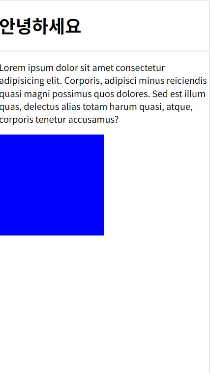

**가로 비율과 세로 비율 중 작은 쪽의 50%이다.**

<hr>

### vmax

```
<!DOCTYPE html>
<html lang="en">
<head>
    <meta charset="UTF-8">
    <meta name="viewport" content="width=device-width, initial-scale=1">
    <title>Viewport</title>
    <style>
        body {
            margin: 0;
            padding: 0;
        }
        div {
            background-color: blue;
            width: 50vmax;
            height: 180px;
        }
    </style>
</head>
<body>
    <h1>안녕하세요</h1>
    <hr>
    <p>
        Lorem ipsum dolor sit amet consectetur adipisicing elit. Corporis, adipisci minus reiciendis quasi magni possimus quos dolores. Sed est illum quas, delectus alias totam harum quasi, atque, corporis tenetur accusamus?
    </p>
    <div></div>
</body>
</html>
```

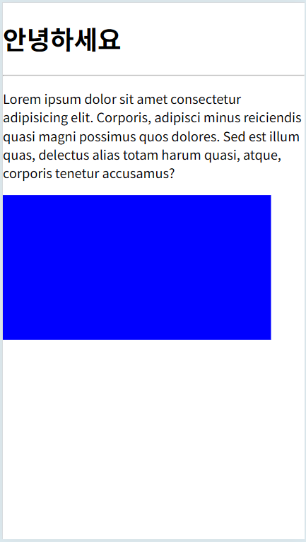

**가로 비율과 세로 비율 중 큰 쪽의 50%이다.**

## 3. 미디어 쿼리

접속하는 디바이스나 뷰포트의 크기에 따라 특정 CSS 스타일을 적용하는 방법이다.

### 중단점 (breakpoint)

특정 CSS 스타일을 적용하는 디바이스나 뷰포트의 크기의 범위

### 미디어 쿼리 문법

**`!@media [only | not] 미디어 유형 [and 조건] * [and 조건]`**

- **only** : 미디어 쿼리를 지원하지 않는 웹 브라우저에서는 미디어 쿼리를 무시하고 실행하지 않는다. (거의 사용)

- **not** : not 다음에 지정하는 미디어 유형을 제외한다.

- **and** : 조건을 여러 개 연결해서 추가할 수 있다.

### 미디어 유형

- **all** : 모든 장치에 적합하다.

- **print** : 인쇄 결과물 및 출력 미리보기 화면에 표시 중인 문서이다.

- **screen** : 주로 화면이 대상이다.

- **speech** : 음성 합성장치 대상이다.

### 미디어 쿼리 조건

- **min-width** : 웹 뷰포트의 최소 너비

-  **max-width** : 웹 뷰포트의 최대 너비

<hr>

### 미디어 쿼리 조건

- 0 ~ 400px : blue

- 401 ~ 600px : red

- 601px ~ : yellow

```
<head>
    <style>
        @media (max-width: 600px) {
            body {
                background-color: red;
            }
        }
        @media (max-width: 400px) {
            body {
                background-color: blue;
            }
        }
        @media (min-width: 601px) {
            body {
                background-color: yellow;
            }
        }
    </style>
</head>
<body>
    <h1>안녕하세요</h1>
    <p>
        Lorem ipsum dolor sit, amet consectetur adipisicing elit. Id neque delectus sit perspiciatis consequatur quos. Ipsum quo iure quae, distinctio odit repellendus ipsam, dolores totam dicta ipsa ullam. Fuga, nesciunt.
        Nesciunt perspiciatis nobis consequuntur aliquam iusto suscipit ipsa saepe. Accusantium quas, provident eveniet quaerat culpa voluptatibus cum magni quae. Neque consequatur quisquam pariatur eligendi. Obcaecati laborum ipsum ratione ex vero.
    </p>
</body>
```

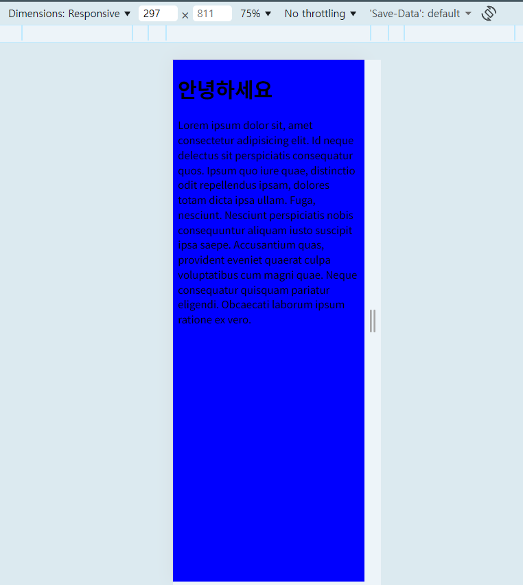

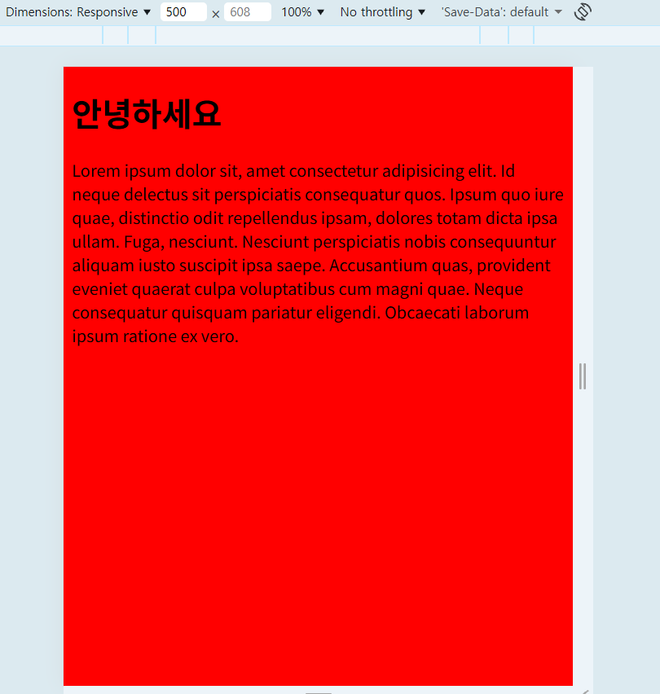

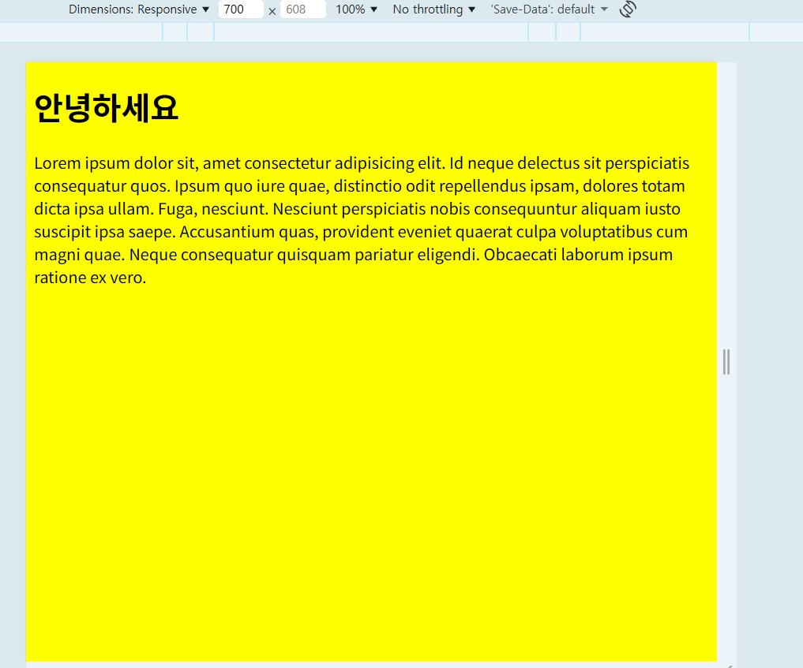

**태그와 같은 경우는 중복되는 범위는 나중에 나오는 코드를 적용한다.**

<hr>

### 미디어 쿼리 유형 (print)

```
<head>
    <style>
        @media print {
            h1 {
                font-size: 120px;
            }
        }
    </style>
</head>
<body>
    <h1>안녕하세요</h1>
    <p>
        Lorem ipsum dolor sit, amet consectetur adipisicing elit. Id neque delectus sit perspiciatis consequatur quos. Ipsum quo iure quae, distinctio odit repellendus ipsam, dolores totam dicta ipsa ullam. Fuga, nesciunt.
        Nesciunt perspiciatis nobis consequuntur aliquam iusto suscipit ipsa saepe. Accusantium quas, provident eveniet quaerat culpa voluptatibus cum magni quae. Neque consequatur quisquam pariatur eligendi. Obcaecati laborum ipsum ratione ex vero.
    </p>
</body>
```

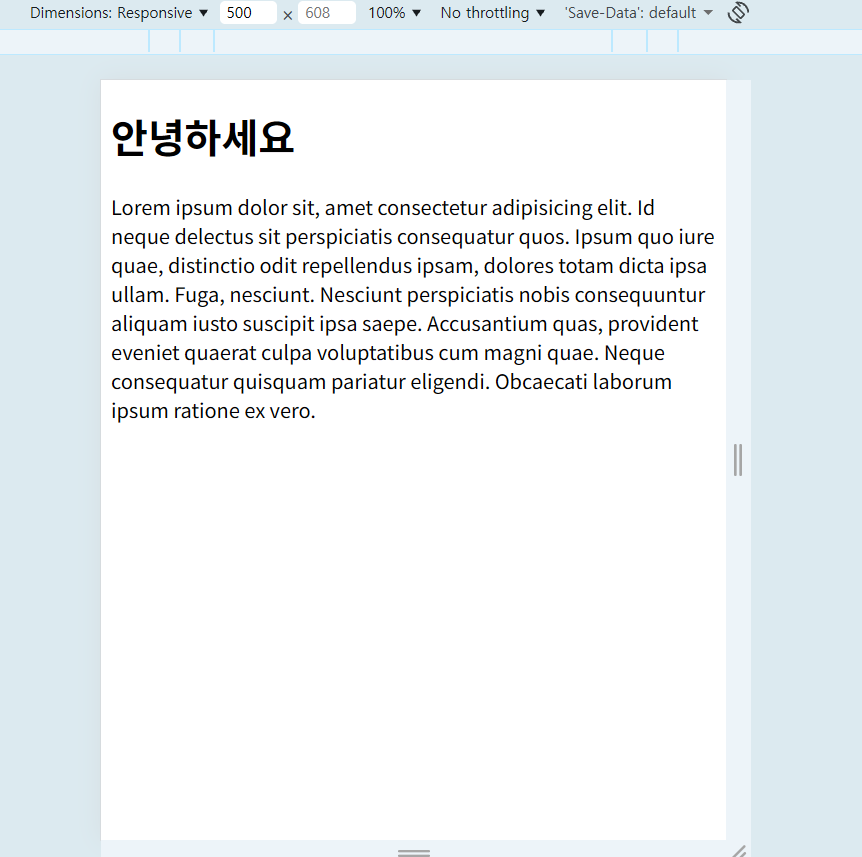

**인쇄 화면에서**

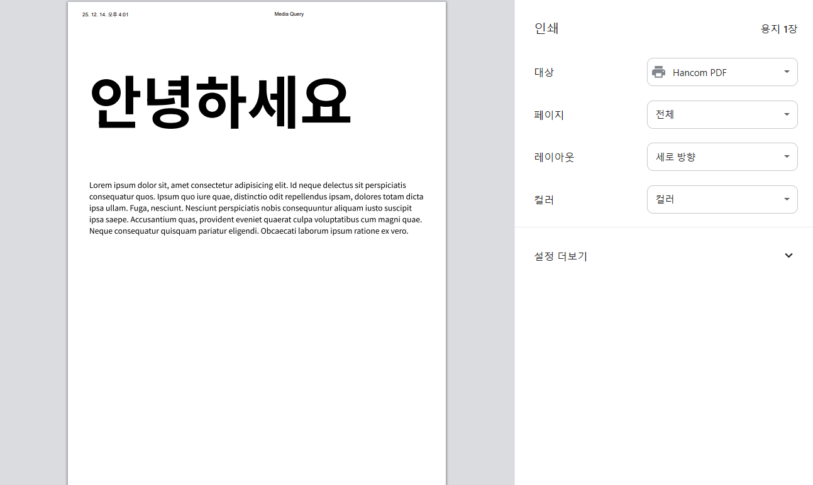

**이처럼 `안녕하세요`의 글씨 크기가 인쇄 화면에서 더 크게 표현된다.**