# 선택자 & 결합자

## 1. 선택자 (Selector)


## 2. 기본 선택자

기본 선택자에는 전체 선택자, 타입 선택자, 클래스 선택자, ID 선택자, 속성 선택자가 있다.

### 전체 선택자 (Universal Selector)

**모든 문법을 선택한다.**

- 용도 : 브라우저 기본 스타일을 초기화하려고 할 때 자주 사용한다.

```
<head>
    <title>Universal selector</title>
    <style>
    /* 모든 요소를 선택함. */
    * {
        margin: 0;
	    padding: 0;
    }
    </style>
</head>
<body>
    <h2>CSS</h2>
    <p>이것은 기본 선택자입니다.</p>
    <p>기본 선택자 중 전체 선택자 입니다.</p>
</body>
```

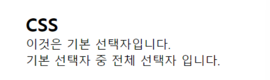

### 타입 선택자 (Type Selector)

**특정 태그 이름을 가진 모든 요소를 선택한다.**

```
<head>
    <title>Type selector</title>
    <style>
    /* 태그명이 h2인 요소를 모두 선택함. */
    h2 {
        color: green;
    }
    </style>
</head>
<body>
    <h2>기본 선택자</h2>
    <p>이것은 기본 선택자입니다.</p>
    <p>기본 선택자 중 타입 선택자 입니다.</p>
</body>
```

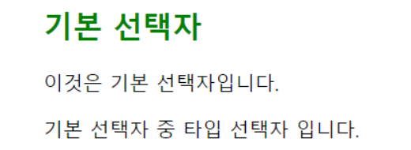

### 클래스 선택자 (Class Selector)

**주어진 class명을 가진 모든 요소를 선택한다.**

**중복**이 가능하다.

```
<head>
    <title>Class selector</title>
    <style>
    /* class에 red--text를 갖고 있는 모든 요소를 선택함. */
    .red--text {
        color: red;
    }
    /* class에 blue--text를 갖고 있는 모든 요소를 선택함. */
    .blue--text {
        color: blue;
    }
    </style>
</head>
<body>
    <h2>CSS</h2>
    <p>이것은 <span class="red--text">기본</span> <span class="red--text">선택자</span>입니다.</p>
    <p><span class="red--text">기본</span> 선택자 중 <span class="blue--text">클래스</span> <span class="red--text">선택자</span> 입니다.</p>
</body>
```

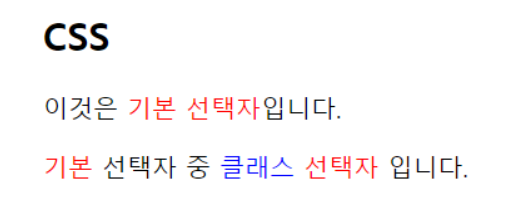

### ID 선택자 (ID Selector)

id 속성에 맞는 요소를 선택한다.

id 선택자는 웹 문서에서 **고유한 하나의 태그**에만 사용해야 한다.

```
<head>
    <title>ID selector</title>
    <style>
    /* id속성이 title인 요소를 선택함. */
    #title {
        font-size: 40px;
        color: darkslategray;
        background-color: yellow;
    }
    </style>
</head>
<body>
    <h2 id="title">CSS</h2>
    <p>이것은 기본 선택자입니다.</p>
    <p>기본 선택자 중 ID 선택자 입니다.</p>
</body>
```


## 3. 속성 선택자 (Attribute Selector)

**주어진 속성을 가진 모든 요소를 검색한다.**

HTML에 있는 속성을 활용해서 특정 HTML 요소를 선택한다.

### 속성이 존재하는 요소

```
<head>
    <title>Selector Attribute</title>
    <style>
    /* 속성이 존재하는 요소 */
    h2[class] {
        font-size: 30px;
    }
    [target] {
        color: green;
    }
    </style>
</head>
<body>
    <h2 class="naver-title">네이버</h2>
    <a href="http://www.naver.com">네이버로 이동</a>
    <h2 class="google-title">구글</h2>
    <a href="http://www.google.com" target="_blank">구글로 이동</a>
    <h2 class="facebook-title">페이스북</h2>
    <a href="http://www.facebook.com">페이스북으로 이동</a>
    <h2>강지현</h2>
    <h2 class="text title jihyun">감사합니다.</h2>
</body>
```

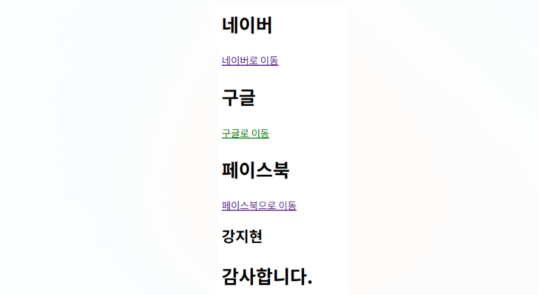

### 속성 값과 일치하는 요소

```
<head>
    <title>Selector Attribute</title>
    <style>
    /* 속성 값과 일치하는 요소 */
    h2[class="naver-title"] {
        color: green;
    }
    </style>
</head>
<body>
    <h2 class="naver-title">네이버</h2>
    <a href="http://www.naver.com">네이버로 이동</a>
    <h2 class="google-title">구글</h2>
    <a href="http://www.google.com" target="_blank">구글로 이동</a>
    <h2 class="facebook-title">페이스북</h2>
    <a href="http://www.facebook.com">페이스북으로 이동</a>
    <h2>강지현</h2>
    <h2 class="text title jihyun">감사합니다.</h2>
</body>
```

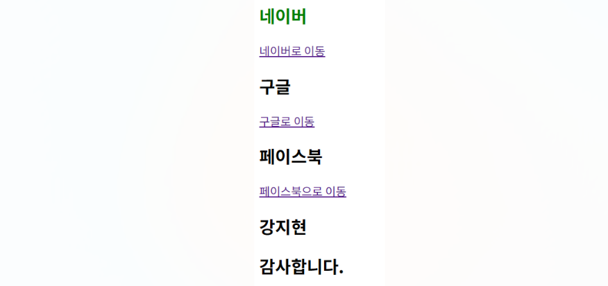

### 속성 값을 포함하는 요소

```
<head>
    <title>Selector Attribute</title>
    <style>
    /* 속성 값을 포함하는 요소 */
    a[href*="www"] {
        text-decoration: none;
    }
    </style>
</head>
<body>
    <h2 class="naver-title">네이버</h2>
    <a href="http://www.naver.com">네이버로 이동</a>
    <h2 class="google-title">구글</h2>
    <a href="http://www.google.com" target="_blank">구글로 이동</a>
    <h2 class="facebook-title">페이스북</h2>
    <a href="http://www.facebook.com">페이스북으로 이동</a>
    <h2>강지현</h2>
    <h2 class="text title jihyun">감사합니다.</h2>
</body>
```

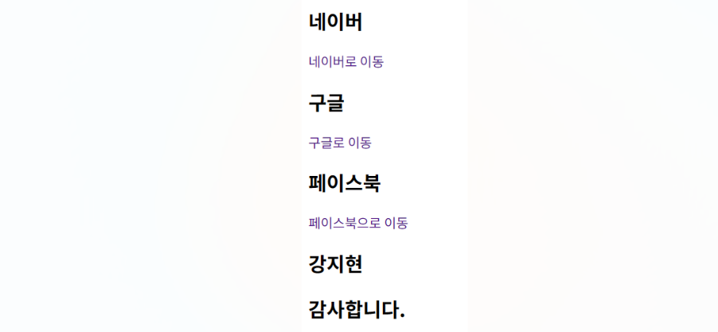

### 속성 값으로 시작하는 요소

```
<head>
    <title>Selector Attribute</title>
    <style>
    /* 속성 값으로 시작하는 요소 */
    h2[class^="google"] {
        color: blue;
    }
    </style>
</head>
<body>
    <h2 class="naver-title">네이버</h2>
    <a href="http://www.naver.com">네이버로 이동</a>
    <h2 class="google-title">구글</h2>
    <a href="http://www.google.com" target="_blank">구글로 이동</a>
    <h2 class="facebook-title">페이스북</h2>
    <a href="http://www.facebook.com">페이스북으로 이동</a>
    <h2>강지현</h2>
    <h2 class="text title jihyun">감사합니다.</h2>
</body>
```

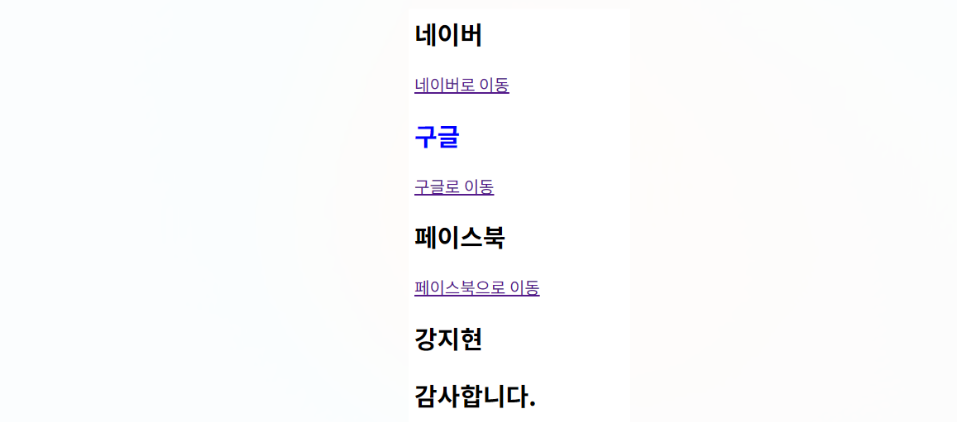

### 속성 값으로 끝나는 요소

```
<head>
    <title>Selector Attribute</title>
    <style>
    /* 속성 값으로 끝나는 요소 */
    a[href$="facebook.com"] {
        color: red;
    }
    </style>
</head>
<body>
    <h2 class="naver-title">네이버</h2>
    <a href="http://www.naver.com">네이버로 이동</a>
    <h2 class="google-title">구글</h2>
    <a href="http://www.google.com" target="_blank">구글로 이동</a>
    <h2 class="facebook-title">페이스북</h2>
    <a href="http://www.facebook.com">페이스북으로 이동</a>
    <h2>강지현</h2>
    <h2 class="text title jihyun">감사합니다.</h2>
</body>
```

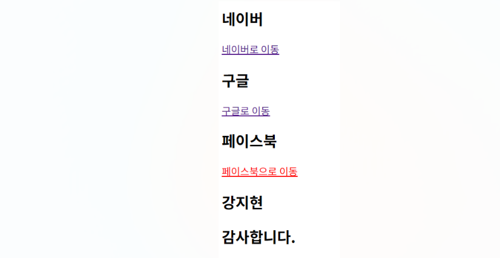

### 속성에 단어가 포함하는 요소

```
<head>
    <title>Selector Attribute</title>
    <style>
    /* 속성에 단어가 포함하는 요소 */
    h2[class~="title"] {
        color: violet;
        font-weight: 500;
    }
    </style>
</head>
<body>
    <h2 class="naver-title">네이버</h2>
    <a href="http://www.naver.com">네이버로 이동</a>
    <h2 class="google-title">구글</h2>
    <a href="http://www.google.com" target="_blank">구글로 이동</a>
    <h2 class="facebook-title">페이스북</h2>
    <a href="http://www.facebook.com">페이스북으로 이동</a>
    <h2>강지현</h2>
    <h2 class="text title jihyun">감사합니다.</h2>
</body>
```

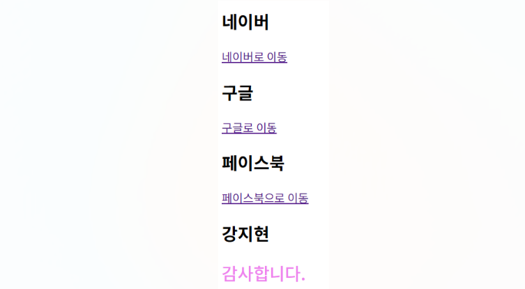

## 4. 그룹 선택자

선택자를 **쉼표(,)로 구분하여 여러 선택자를 나열**할 수 있다.

같은 스타일을 여러 선택자에 한꺼번에 정의할 수 있다.

```
<head>
    <title>Group selector</title>
    <style>
    /* 그룹 선택자 */
    h1, h2 {
        text-align: center;
    }
    </style>
</head>
<body>
    <h1>웹 사이트 제작</h1>
    <h2>CSS</h2>
    <p>이것은 그룹 선택자입니다.</p>
</body>
```

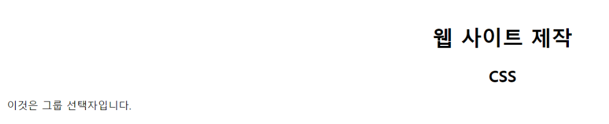

## 5. 결합자

결합자에는 자손 결합자, 자식 결합자, 일반 형제 결합자, 인접 형제 결합자가 있다.

## 6. 자손 결합자

**첫 번째 요소의 자손인 태그를 모두 선택한다.**

```
<head>
    <style>
        /* 자손 결합자 */
        section li {
            color: blue;
        }
        section span {
            color: red;
        }
    </style>
</head>
<body>
    <section>
        <h1>CSS</h1>
        <p>결합자를 설명합니다.</p>
        <ul>
            <li>자손 결합자</li>
            <li>자식 결합자</li>
            <li>일반 <span>형제</span> 결합자</li>
            <li>인접 형제 결합자</li>
        </ul>
    </section>
</body>
```


## 7. 자식 결합자

**`>` 를 사용하고 첫 번째 요소의 바로 아래 자식인 태그를 선택한다.**

즉, **바로 하위에 있는 태그들만 선택한다.**

```
<head>
    <style>
        /* 자식 결합자 */
        ul > li {
            color: brown;
        }
        /* section > ul > li {
            color: brown; 도 가능
        } */
    </style>
</head>
<body>
    <section>
        <h1>CSS</h1>
        <p>결합자를 설명합니다.</p>
        <ul>
            <li>자손 결합자</li>
            <li>자식 결합자</li>
            <li>일반 <span>형제</span> 결합자</li>
            <li>인접 형제 결합자</li>
        </ul>
    </section>
</body>
```


## 8. 일반 형제 결합자

**`~` 를 사용하고 형제, 즉 첫 번째 요소를 뒤따르면서 같은 부모를 공유하는 두 번째 요소를 선택한다.**

```
<head>
    <style>
        /* 일반 형제 결합자 */
        p ~ span {
            color: red;
        }
    </style>
</head>
<body>
    <section>
        <h1>CSS</h1>
        <span>이전에 선택자를 설명했습니다.</span>
        <p>현재는 결합자를 설명합니다.</p>
        <span>자손 결합자</span><br>
        <code>코드가 있어요</code><br>
        <span>자식 결합자</span><br>
        <span>일반 형제 결합자</span><br>
        <span>인접 형제 결합자</span>
    </section>
</body>
```

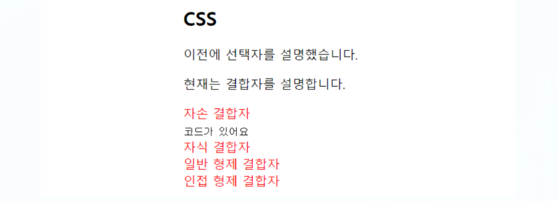

## 9. 인접 형제 결합자

**`+`를 사용하고 형제, 즉 첫 번째 요소의 바로 뒤에 위치하면서 같은 부모를 공유하는 두 번째 요소를 선택**한다.

```
<head>
    <style>
        /* 인접 형제 결합자 */
        p + span {
            color: red;
        }
        .first + li {
            color: blue;
        }
    </style>
</head>
<body>
    <section>
        <h1>CSS</h1>
        <span>이전에 선택자를 설명했습니다.</span>
        <p>현재는 결합자를 설명합니다.</p>
        <span>자손 결합자</span><br>
        <code>코드가 있어요</code><br>
        <span>자식 결합자</span><br>
        <span>일반 형제 결합자</span><br>
        <span>인접 형제 결합자</span>
    </section>
    <ul>
        <li class="first">one</li>
        <li>two</li>
        <li>three</li>
    </ul>
</body>
```

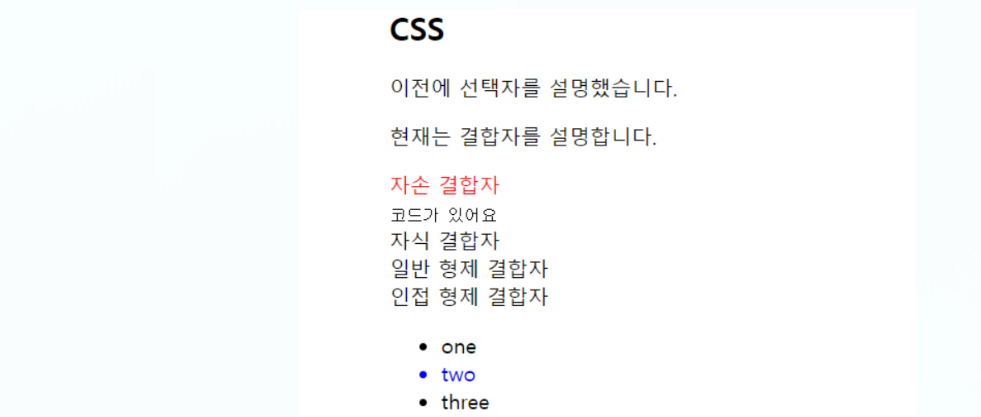

## 10. CSS 적용 우선 순위

- `!important` > `인라인 스타일` > `ID 스타일` > `class 스타일` > `Tag 스타일`