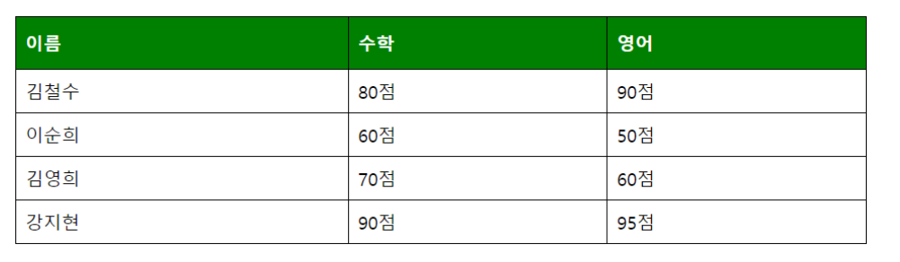

# Table

## 1. 표 (Table) 속성

- `<table>` 태그에 `<border>` 속성을 사용하여 테두리를 그릴 수 있다.

- `border-collapse: collapse;` 속성을 사용하여 중복된 테두리를 하나로 합친다.

- `hover`: 마우스를 올린 상태를 의미한다.

```
<head>
    <style>
        #grade {
            border-collapse: collapse;
            width: 100%;
        }
        #grade td,
        #grade th {
            border: 1px solid black;
            padding: 8px;
        }
        #grade th {
            padding-top: 12px;
            padding-bottom: 12px;
            text-align: left;
            background-color: green;
            color: white;
        }
    </style>
</head>
<body>
    <table id="grade">
        <tr>
            <th>이름</th>
            <th>수학</th>
            <th>영어</th>
        </tr>
        <tr>
            <td>김철수</td>
            <td>80점</td>
            <td>90점</td>
        </tr>
        <tr>
            <td>이순희</td>
            <td>60점</td>
            <td>50점</td>
        </tr>
        <tr>
            <td>김영희</td>
            <td>70점</td>
            <td>60점</td>
        </tr>
        <tr>
            <td>강지현</td>
            <td>90점</td>
            <td>95점</td>
        </tr>
    </table>
</body>
```

