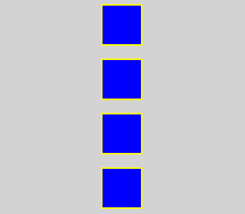
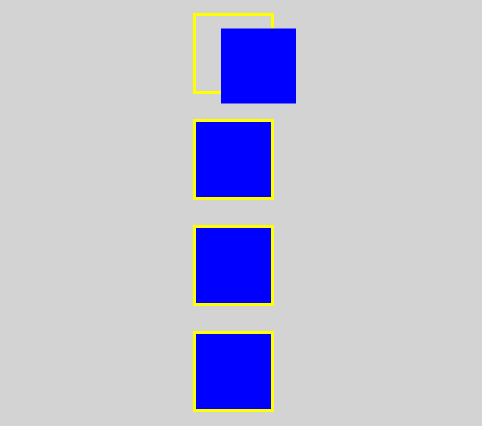
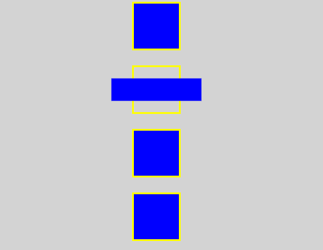
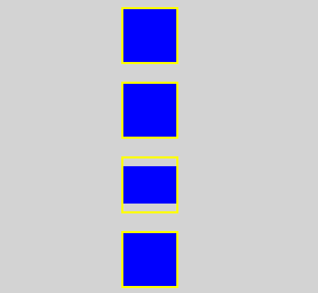
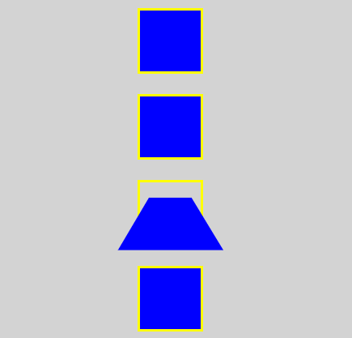
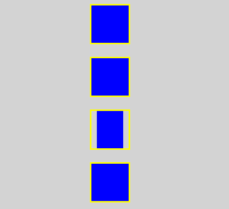
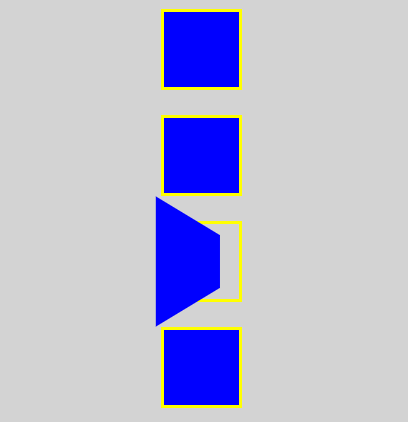
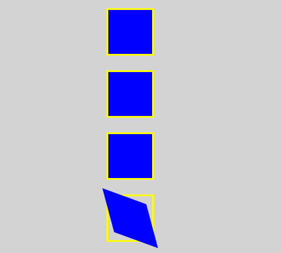
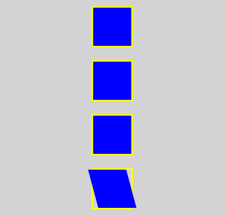
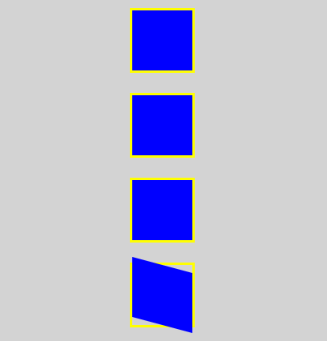

# Transform

## 1. Transform 속성

HTML 요소를 **회전, 크기 조절, 기울이기, 이동 효과**를 나타낼 때 사용한다.

특수한 함수를 활용해서 표현한다.

> 단, 해당 요소의 display 속성은 `block` 또는 `inline-block`

```
<head>
    <style>
        body {
            margin: 0px;
            padding: 0px;
            background-color: lightgray;
        }
        .outline, .box {
            width: 60px;
            height: 60px;
        }
        .outline {
            border: 3px solid yellow;
            margin: 0 auto;
            margin-top: 20px;
        }
        .box {
            background-color: blue;
        }
    </style>
</head>
<body>
    <div class="outline">
        <div class="box box1"></div>
    </div>
    <div class="outline">
        <div class="box box2"></div>
    </div>
    <div class="outline">
        <div class="box box3"></div>
    </div>
    <div class="outline">
        <div class="box box4"></div>
    </div>
</body>
```



**실무에서는 아래 코드처럼 기본 브라우저 스타일을 초기화하여 사용**

```
body {
    margin: 0px;
    padding: 0px;
}
```

**`margin: 0 auto;`를 하면 중앙에 배치**

그러나 `margin: auto auto;`는 적용이 안 됨.

=> WHY?  HTML에서 `margin top`과 `margin bottom`의 `auto`는 0으로 인식되기 때문이다.

## 2. Transform 함수

- **`translate(tx, ty)` : 지정한 크기만큼 x축&y축으로 이동**

- `translateX(tx)` : 지정한 크기만큼 x축으로 이동

- `translateY(ty)` : 지정한 크기만큼 y축으로 이동

- **`scale(sx, sy)` : 지정한 크기만큼 x축&y축으로 확대&축소**

- `scaleX(sx)` : 지정한 크기만큼 x축으로 확대&축소

- `scaleY(sy)` : 지정한 크기만큼 y축으로 확대&축소

- **`rotate(각도)` : 지정한 각도만큼 회전**

    - `+` : 시계방향

    - `-` : 반시계방향

- `rotateX(각도)` : x축을 기준으로 회전

    - 입체감 표현 => `perspective` 속성을 부모 요소에 적용

- `rotateY(각도)` : y축을 기준으로 회전

    - 입체감 표현 => `perspective` 속성을 부모 요소에 적용

- `rotateZ(각도)` : z축을 기준으로 회전

    - 입체감 표현 => `perspective` 속성을 부모 요소에 적용

- **`skew(ax, ay)` : 지정한 각도만큼 x축&y축으로 왜곡**

- `skewX(ax)` : 지정한 각도만큼 x축으로 왜곡

- `skewY(ay)` : 지정한 각도만큼 y축으로 왜곡

### translate 함수

```
<head>
    <style>
        body {
            margin: 0px;
            padding: 0px;
            background-color: lightgrey;
        }
        .outline, .box {
            width: 60px;
            height: 60px;
        }
        .outline {
            border: 3px solid yellow;
            margin: 0 auto; /* 상하 0 좌우 auto */
            margin-top: 20px;
        }
        .box {
            background-color: blue;
        }
        .box1 {
            transform: translate(20px, 10px);
        }
    </style>
</head>
<body>
    <div class="outline">
        <div class="box box1"></div>
    </div>
    <div class="outline">
        <div class="box box2"></div>
    </div>
    <div class="outline">
        <div class="box box3"></div>
    </div>
    <div class="outline">
        <div class="box box4"></div>
    </div>
</body>
```



### scale 함수

```
<head>
    <style>
        body {
            margin: 0px;
            padding: 0px;
            background-color: lightgrey;
        }
        .outline, .box {
            width: 60px;
            height: 60px;
        }
        .outline {
            border: 3px solid yellow;
            margin: 0 auto; /* 상하 0 좌우 auto */
            margin-top: 20px;
        }
        .box {
            background-color: blue;
        }
        .box2 {
            transform: scale(2, 0.5);
        }
    </style>
</head>
<body>
    <div class="outline">
        <div class="box box1"></div>
    </div>
    <div class="outline">
        <div class="box box2"></div>
    </div>
    <div class="outline">
        <div class="box box3"></div>
    </div>
    <div class="outline">
        <div class="box box4"></div>
    </div>
</body>
```



### rotate 함수

```
<head>
    <style>
        body {
            margin: 0px;
            padding: 0px;
            background-color: lightgrey;
        }
        .outline, .box {
            width: 60px;
            height: 60px;
        }
        .outline {
            border: 3px solid yellow;
            margin: 0 auto; /* 상하 0 좌우 auto */
            margin-top: 20px;
        }
        .box {
            background-color: blue;
        }
        .box3 {
            transform: rotate(45deg);
        }
    </style>
</head>
<body>
    <div class="outline">
        <div class="box box1"></div>
    </div>
    <div class="outline">
        <div class="box box2"></div>
    </div>
    <div class="outline">
        <div class="box box3"></div>
    </div>
    <div class="outline">
        <div class="box box4"></div>
    </div>
</body>
```


**식별이 어렵기 때문에 `perspective` 속성을 이용하여 원근감을 표현**

- `perspective` 사용 전

```
<style>
    .box3 {
        transform: rotateX(45deg);
    }
</style>
<body>
    <div class="outline">
        <div class="box box3"></div>
    </div>
</body>
```



- `perspective` 사용 후

```
<style>
    .box3 {
        transform: rotateX(45deg);
    }
    .outline-box3 {
        perspective: 50px;
    }
</style>
<body>
    <div class="outline outline-box3">
        <div class="box box3"></div>
    </div>
</body>
```



**`persective: 값;`에서 값이 작을수록 원근감이 더 가깝게 느껴진다.**

- `perspective` 사용 전

```
<style>
    .box3 {
        transform: rotateY(45deg);
    }
</style>
<body>
    <div class="outline">
        <div class="box box3"></div>
    </div>
</body>
```



- `perspective` 사용 후

```
<style>
    .box3 {
        transform: rotateY(45deg);
    }
    .outline-box3 {
        perspective: 50px;
    }
</style>
<body>
    <div class="outline outline-box3">
        <div class="box box3"></div>
    </div>
</body>
```



**`rotateZ(45deg)`는 `rotate(45deg)`와 동일**

### skew 함수

```
<head>
    <style>
        body {
        margin: 0px;
        padding: 0px;
        background-color: lightgray;
        }
        .outline, .box {
        width: 60px;
        height: 60px;
        }
        .outline {
        border: 3px solid yellow;
        margin: 0 auto;
        margin-top: 20px;
        }
        .box {
        background-color: blue;
        }
        .box4 {
        transform: skew(15deg, 20deg);
        }
    </style>
</head>
<body>
    <div class="outline">
        <div class="box box1"></div>
    </div>
    <div class="outline">
        <div class="box box2"></div>
    </div>
    <div class="outline">
        <div class="box box3"></div>
    </div>
    <div class="outline">
        <div class="box box4"></div>
    </div>
</body>
```



**x축으로 비틀림**

```
<style>
    .box4 {
        transform: skewX(15deg);
    }
</style>
```



**y축으로 비틀림**

```
<style>
    .box4 {
        transform: skewY(15deg);
    }
</style>
```

