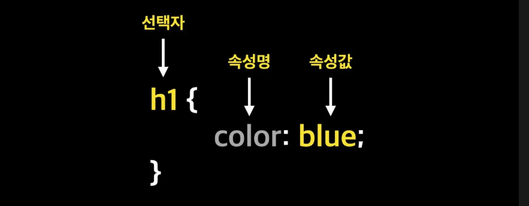

# CSS 정의

## 1. CSS란?

**CSS(Cascading Style Sheets)** 는 마크업 언어로서, HTML 문서를 꾸밀 때 사용하는 스타일을 잘 정리한 문서이다.

**HTML로 웹 페이지의 뼈대를 만들고, CSS로 웹 페이지를 예쁘게 꾸미는 역할을 한다.**

## 2. CSS 구조



- **선택자 or Selector** : 꾸미고 싶은 HTML 요소(태그)를 선택한다.

    ex) `h1` 태그를 선택

- **속성명** : 꾸미고 싶은 속성명을 입력한다.

    ex) `color`

- **속성값** : 어떻게 꾸밀지 속성 값을 입력한다.

    ex) `blue`

## 3. CSS 적용 방법

- **인라인 스타일 - Inline Style Sheet**

- **내부 스타일 - Internal Style Sheet**

- **외부 스타일 - External Style Sheet**

### 인라인 스타일 - Inline Style Sheet

스타일을 정의하고 싶은 HTML 요소에 스타일을 적용한다.

```
<!DOCTYPE html>
<html lang="en">
<head>
    <meta charset="UTF-8">
    <title>Inline Style</title>
</head>
<body>
	<!-- 인라인 스타일(Inline Style) -->
	<h1 style="color: blue">제목</h1>
	<div style="width: 100px; height: 100px; border: 1px solid red;"></div>
</body>
</html>
```

- 여러 개의 속성을 적용하고 싶으면 **세미콜론(;)** 을 사용하여 작성한다.

    -> `style="width: 100px; height: 100px;...`

### 내부 스타일 - Internal Style Sheet

`<head>` 태그 안에 `<style>` 태그를 사용하여 정의한다.

```
<!DOCTYPE html>
<html lang="en">
<head>
    <meta charset="UTF-8">
    <meta name="viewport" content="width=device-width, initial-scale=1.0">
    <title>Internal Style</title>
    <style>
        h1 {
            color: blue;
        }
        .content {
            border: 2px solid red;
            background-color: yellow;
            padding: 10px;
        }
    </style>
</head>
<body>
    <h1>헬스</h1>
    <p class="content">오늘도 헬스장에서 운동을 한다.</p>
</body>
</html>
```

- 단점 : 많은 페이지에 동일한 스타일 규칙을 적용시키기 위해서는 모든 페이지마다 `style` 태그를 복사해서 붙여넣기 해야 함. 

    -> **외부 스타일(External Style) 많이 사용**

### 외부 스타일 - External Style Sheet

**CSS 파일을 외부에 정의해놓고, 외부에 정의한 CSS를 HTML 파일에 연결하여 사용하는 것을 말한다.**

- 외부 style.css 파일 정의

    - 외부 파일의 확장자는 css

```
/* style.css File */
h1 {
    color: cyan;
}
.article {
    border: 1px solid black;
    padding: 30px;
}
```

- HTML 파일에서 외부 style.css 파일 연결

```
<!DOCTYPE html>
<html lang="en">
<head>
    <meta charset="UTF-8">
    <meta name="viewport" content="width=device-width, initial-scale=1.0">
    <title>External Style</title>
    <link rel="stylesheet" href="./style.css">
</head>
<body>
    <h1>CSS</h1>
    <p class="article">웹 페이지를 예쁘게 꾸미는 역할이다.</p>
</body>
</html>
```

- CSS 파일과 HTML 파일을 연결할 때는 `<link>` 태그를 사용해야 한다.

    - `<head>` 태그 내에 선언된다.

## 4. CSS 주석

주석은 StyleSheet 내에 메모를 남기는 것을 말한다.

```
/* 메모내용 */
h2 {
    color: blue;
}

/*
	메모내용이 여러줄일 경우 
*/
```

## 5. CSS 출처

- **제작자 스타일**

    - 웹 사이트를 제작하는 사람이 작성한 스타일 시트이다.

    - ex) 인라인 스타일, 내부 스타일, 외부 스타일

- **사용자 스타일**

    - 사용자를 방문하는 일반 사용자들이 구성한 스타일 시트이다.

    - ex) 윈도우의 고대비 설정 기능 등

- **브라우저 스타일**

    - 브라우저들마다 기본적으로 지정하고 있는 스타일이다.

### CSS 출처 적용 우선순위

`사용자 !important` > `제작자 !important` > `제작자` > `사용자` > `브라우저`

- `!important` 는 폭포의 흐름을 깰 수 있으므로 주의해서 사용해야 한다.