# Form

**Form은 웹에서 사용자의 정보를 입력받기 위해 사용한다.**

- **Form** : 입력받는 데이터들을 묶는 것

- **Form data, Field** : 데이터

## 1. 폼 태그

**`<form>`** : 어디서부터 어디까지 양식인지 지정하는 역할

```
<form action="/signup" method="post">
    <div class="form-example">
        <label for="name">이름: </label>
        <input type="text" name="name" id="name" required>
    </div>
    <div class="form-example">
        <label for="email">이메일: </label>
        <input type="email" name="email" id="email" required>
    </div>
    <div class="form-example">
        <input type="submit" vlaue="제출하기">
    </div>
</form>
```


### 속성

- **action** : 양식 데이터를 처리할 서버 프로그램의 URI

- **method** : 양식을 제출할 때 사용할 HTTP 메서드

    - **post** : 요청 본문으로 전송한다. (저장, 수정)

    - **get** : URL의 쿼리스트링으로 붙여서 전송한다.

**action**, **method**는 서버 측에 값을 보낼 때 사용

## 2. fieldset

- **양식의 여러 컨트롤과 레이블을 묶을 때 사용한다.**

- form 안에 form 데이터를 그룹화하는 것이다.

### legend

요소는 부모 `<fieldset>` 콘텐츠 설명을 나타낸다.

## 3. Input 태그

- `<input>` 요소로 데이터를 입력받을 수 있다.

- `type` 속성을 통하여 다양한 방법으로 데이터를 받을 수 있다.

### text

- `<input>` 태그의 기본 값으로 **한 줄의 텍스트를 입력받는다.**

- 일반적인 텍스트를 받기 위해 사용된다.

```
<input type="text" id="name">
```

```
<head>
</head>
<body>
    <form action="">
        <div>
            <label for="username">아이디</label>
            <input type="text" id="username">
        </div>
    </form>
</body>
```


### password

- **비밀번호를 받기 위해 사용된다.**

- **유효성 검증**

```
<head>
</head>
<body>
    <form action="">
        <div>
            <label for="password">비밀번호</label>
            <input type="password" id="password">
        </div>
    </form>
</body>
```

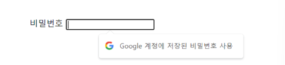

### email

- **email 데이터를 받기 위해 사용된다.**

- **이메일 유효성 검증**

```
<head>
</head>
<body>
    <form action="">
        <div>
            <label for="email>이메일</label>
            <input type="email" id="email">
        </div>
    </form>
</body>
```


### tel

- **전화번호를 받기 위해 사용된다.**

- **모바일 접근 시 키패드가 다름**

```
<head>
</head>
<body>
    <form action="">
        <div>
            <label for="tel">전화번호</label>
            <input type="tel" id="tel">
        </div>
    </form>
</body>
```


### checkbox

- **여러 개의 체크박스 항목 중 2개 이상 선택할 수 있다.**

- 그리고 체크박스 선택 시 선택된 체크박스의 `value` 값이 서버로 전송된다.

```
<body>
    <form action="/signup">
        <fieldset>
            <legend>좋아하는 과일을 선택해주세요.</legend>
            <ul>
                <li>
                    <label for="apple">사과</label>
                    <input id="apple" type="checkbox" value="apple">
                </li>
                <li>
                    <label for="orange">오렌지</label>
                    <input id="orange" type="checkbox" value="orange">
                </li>
                <li>
                    <label for="banana">바나나</label>
                    <input id="banana" type="checkbox" value="banana">
                </li>
            </ul>
        </fieldset>
        <input type="submit" value="제출하기">
    </form>
</body>
```

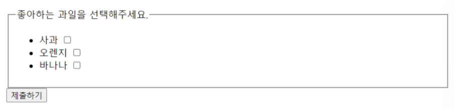

### radio

- **여러 개의 라디오 항목 중 1개를 선택할 수 있다.**

- 그리고 라디오 항목 선택 시 선택된 항목의 `value` 값이 서버로 전송된다.

- 여러 개 중 하나를 선택하게 하려면 그 여러 항목의 `<radio name=" ">`에서 `name` 속성 값을 같은 값으로 그룹핑 해주어야 한다.

    (name을 일치시켜야 함)

```
<body>
    <form action="/signup">
        <fieldset>
            <legend>좋아하는 과일을 하나만 선택해주세요.</legend>
            <ul>
                <li>
                    <label for="strawberry">딸기</label>
                    <input id="strawberry" name="fruit" type="radio" value="strawberry">
                </li>
                <li>
                    <label for="grape">포도</label>
                    <input id="grape" name="fruit" type="radio" value="grape">
                </li>
                <li>
                    <label for="peach">복숭아</label>
                    <input id="peach" name="fruit" type="radio" value="peach">
                </li>
            </ul>
        </fieldset>
        <input type="submit" value="제출하기">
    </form>
</body>
```

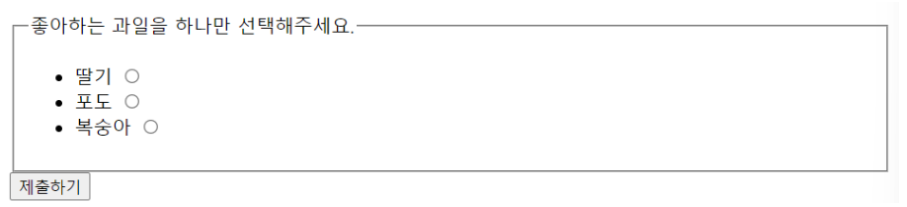

### number

`<input type="number">` 속성은 **숫자를 입력하기 위한 필드**이다.

- min 속성으로 최소값을 지정

- max 속성으로 최댓값을 지정

- value 속성은 이 요소의 **현재 값**이며, 초기에 value 값이 화면에 표시됨.

- 실행 시 우측에 숫자 증가, 감소시키는 화살표 표현

- 한글, 문자는 입력이 불가능

- 최댓값과 최솟값 입력 가능하다.

```
<body>
    <form action="">
        <fieldset>
            <legend>Number</legend>
            <ul>
                <li>
                    <label for="number">number</label>
                    <input type="number" id="number" min="5" max="10">
                </li>
            </ul>
        </fieldset>
        <input type="submit" value="제출하기">
    </form>
</body>
```

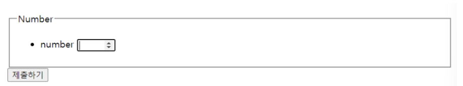

### 날짜/시간

date, month, week, time, datetime, datetime-local 값을 사용하여 **날짜와 시간 데이터를 입력받을 수 있다.**

- min 속성으로 **최소 날짜**를 지정한다.

- max 속성으로 **최대 날짜**를 지정한다.

```
<body>
    <form action="">
        <fieldset>
            <legend>날짜관련</legend>
            <ul>
                <li>
                    <label for="date">date</label>
                    <input type="date" id="date" min="2025-01-01" max="2025-01-10">
                </li>
                <li>
                    <label for="month">month</label>
                    <input type="month" id="month">
                </li>
                <li>
                    <label for="week">week</label>
                    <input type="week" id="week">
                </li>
            </ul>
        </fieldset>
        <fieldset>
            <legend>시간관련</legend>
            <ul>
                <li>
                    <label for="time">time</label>
                    <input type="time" id="time" min="16:00" max="18:00">
                </li>
            </ul>
        </fieldset>
        <input type="submit" value="제출하기">
    </form>
</body>
```

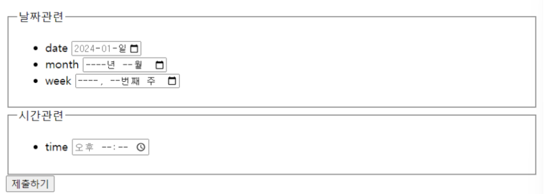

### hidden

**눈에 보이지는 않지만 서버로 값을 전송하려고 할 때 사용하는 요소**

- **name 속성 & value 속성을 함께 지님**

- ex) 가입시간, 가입경로 등

```
<body>
    <form action="">
        <fieldset>
            <legend>Hidden</legend>
            <ul>
                <li>
                    <input type="hidden" name="" value="">
                </li>
            </ul>
        </fieldset>
    </form>
</body>
```

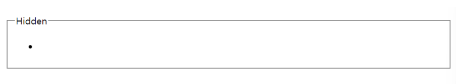

### file

- **파일을 선택할 수 있는 필드이다.**

- `accept` 속성을 사용하면 허용하는 파일 유형을 지정할 수 있다.

- **multiple 선택 시 file 다중 선택 가능하다.**

```
<body>
    <form action="">
        <fieldset>
        <legend>File</legend>
        <ul>
            <li>
                <input type="file" name="file" multiple>
            </li>
        </ul>
        </fieldset>
    </form>
</body>
```

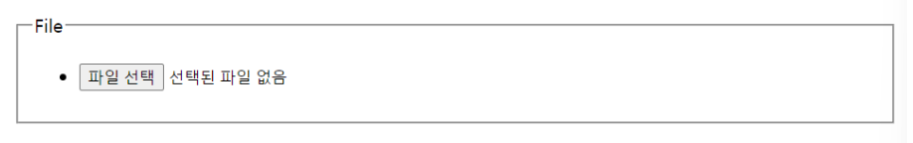

### button

**버튼 모양의 위젯**을 생성한다.

```
<body>
    <form action="">
        <fieldset>
            <legend>Button</legend>
            <ul>
                <li>
                    <input type="Button">클릭</button>
                </li>
            </ul>
        </fieldset>
    </form>
</body>
```

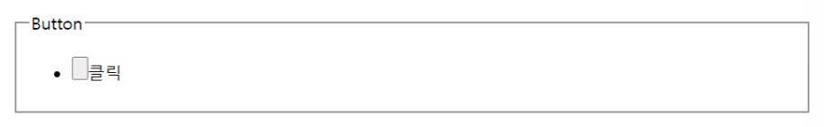

## 4. label

- `<label>` 태그는 **입력받는 필드를 설명할 때 사용한다.**

- **`<label>` 태그 하위에 `<input>` 태그를 위치시킬 수 있고 `id`와 `for` 속성을 사용하여 `<input>` 태그와 연결**지을 수 있다.

```
<!-- label 태그 하위에 놓는 법 -->
<label>
    이름 :
    <input type="text" id="name">
</label>

<!-- for와 id 속성을 사용하여 label 태그와 연결지음 -->
<label for="name">이름 : </label>
<input type="text" id="name">
```

- **`label의 for`와 `input의 id`가 일치해야 한다.**

## 5. Form 데이터 태그 속성

- **required**

    - 입력 값이 필수라는 것을 명시할 수 있다.

- **readonly**

    - 값을 변경하지 못하게 읽기 전용 필드로 만들 수 있다.

- **disabled**

    - 비활성화시킬 수 있으며 해당 필드는 서버로 전송되지 않는다.

- **autofocus**

    - 초기에 해당 필드에 커서를 위치 시킬 수 있다.

- **placeholder**

    - 입력 필드가 비어있을 때 해당 입력 값의 설명 또는 가이드 문구를 삽입할 수 있다.

## 6. Textarea

**여러 줄의 데이터를 입력 받을 수 있다.**

```
<body>
    <form action="">
        <fieldset>
            <legend>자기소개서</legend>
            <textarea name="" id="" cols="60" rows="5">저는 강지현입니다.</textarea>
        </fieldset>
    </form>
</body>
```

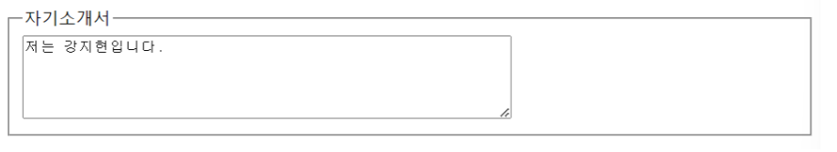

### 속성

- **rows** : 화면에 표시되는 행 수를 지정

- **cols** : 화면에 표시되는 컬럼 수를 지정

## 7. Select

- `<select>` 태그는 **옵션 메뉴를 제공**한다.

- `<option>` 태그로 각 항목을 나타내며 `<select>` 태그는 `<option>` 태그를 감싸준다.

```
<body>
    <form action="">
        <fieldset>
            <legend>주문 상품을 선택해주세요!</legend>
            <ul>
                <li>
                    <select name="goods" id="goods">
                        <option value="10kg">사과 10kg</option>
                        <option value="20kg" selected>사과 20kg</option>
                        <option value="30kg">사과 30kg</option>
                        <option value="40kg">사과 40kg</option>
                        <option value="50kg">사과 50kg</option>
                    </select>
                </li>
            </ul>
        </fieldset>
    </form>
</body>
```

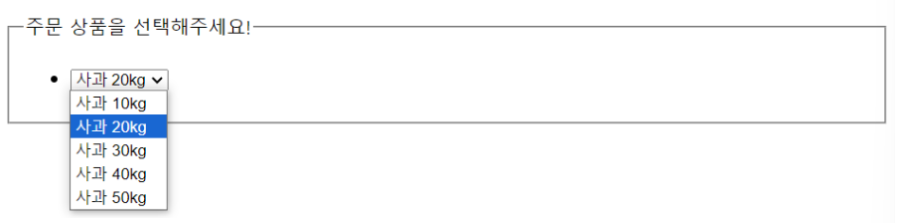

옵션 안에 있는 내용은 사용자 화면에 보여주는 내용이며 **실제 서버로 전송되는 값은 value 안의 값이다.**

### 속성

**selected 해당 속성은 현재 `<select>` 요소에서 선택된 항목 `<option>`을 가리킨다.**

## 8. datalist

다음 컨트롤에서 고를 수 있는 가능한, 혹은 추천하는 선택지를 나타내는 `<option>` 요소를 여럿 담는다.

- **input list 속성과 datalist id 속성을 일치시켜야 한다.**

```
<body>
    <form action="">
        <fieldset>
            <legend>주문 상품을 선택해주세요!</legend>
            <ul>
                <li>
                    <label for="ice-cream-choice">맛을 선택하세요</label>
                    <input list="ice-cream-flavors" id="ice-cream-choice" name="ice-cream-choice">
                    <datalist id="ice-cream-flavors">
                        <option value="Chocolate">
                        <option value="Coconut">
                        <option value="Mint">
                        <option value="Strawberry">
                        <option value="Vanilla">
                    </datalist>
                </li>
            </ul>
        </fieldset>
    </form>
</body>
```

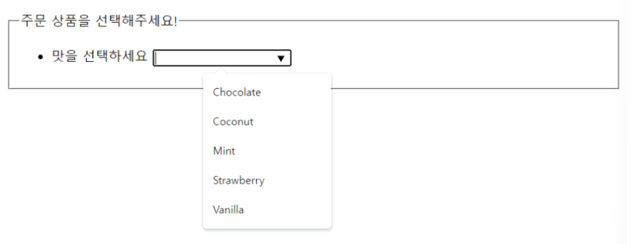

## 9. Button

- `<button>` 요소는 **클릭 가능한 버튼**을 나타낸다.

- `<form>` 내부는 무론이고 버튼 기능이 필요한 곳이라면 어디에나 배치할 수 있다.

```
<body>
    <form action="">
        <fieldset>
            <legend>주문 상품을 선택해주세요!</legend>
            <ul>
                <li>
                    <label for="ice-cream-choice">맛을 선택하세요</label>
                    <input list="ice-cream-flavors" id="ice-cream-choice" name="ice-cream-choice">
                    <datalist id="ice-cream-flavors">
                        <option value="Chocolate">
                        <option value="Coconut">
                        <option value="Mint">
                        <option value="Strawberry">
                        <option value="Vanilla">
                    </datalist>
                </li>
            </ul>
        </fieldset>
        <button type="submit">제출하기</button>
        <button type="reset">리셋하기</button>
        <button type="button" onclick="alert('Hello World~!')">버튼</button>
    </form>
</body>
```

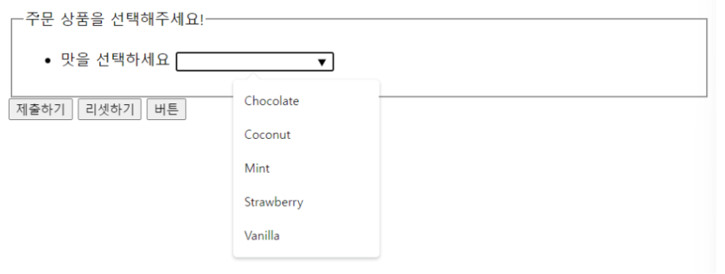

### type

**버튼의 행동 방식을 선언한다.**

- **submit** : 버튼이 서버로 양식 데이터를 제출한다. (기본 값)

- **reset** : `<input type="reset">`처럼 모든 입력 필드를 **초기값으로 되돌린다.**

- **button** : 기본 행동이 없으며 주로 클릭한 후 **자바스크립트 측 코드를 명령할 때 사용한다.**