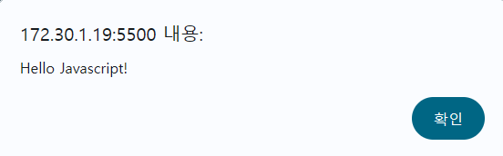

# 자바스크립트 기본 학습

### 자바스크립트 사용법

- `<script>~</script>` : script 태그 안에 Javascript 코드 사용

- `<script src="파일경로" />` : script 태그 안에 src 속성에 자바스크립트 파일 경로 삽입

### console.log

- 콘솔 화면에 메시지를 출력한다.

- 여러개를 넣을 경우 `console.log('Hello', 'javascript!')`와 같이 작성할 수 있다.

### alert

브라우저에서 경고창을 띄운다.

```
alert('Hello Javascript!');
```



### 주석

- `//` : 한 줄 주석

- `/* */` : 긴 줄 주석

### 값 표현하는 방법

- 숫자 : 23123

- 문자 : 작은 따옴표나 큰 따옴표로 표현

- 세미콜론 : 명령문 끝에 표현

### 변수

다양한 값을 저장할 수 있다.

`let`을 이용하여 변수명을 선언한다.

```
let str = 'Hello Javascript!';
```

### 함수 (메서드)

코드를 편하게 재사용하기 위해서 그룹화한 것을 의미한다.

### 객체

변수와 함수를 갖고 있는 놈 -> 객체

변수 -> 프로퍼티

### 이벤트

HTML 요소에서 발생한 사건을 의미한다.