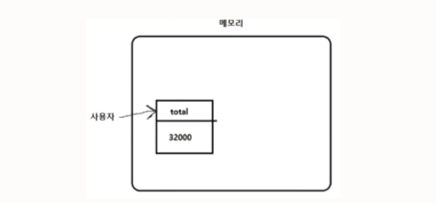

# 기본 문법 배우기_4

## 변수

**변수(variable) : 값을 저장하고, 저장한 값을 불러올 수 있게 하는 것**

**선언(declaration) : 변수를 만드는 행위**

**초기화(initialization) : 변수를 선언함과 동시에 값을 대입하는 행위**

`console.log(변수)`로 변수의 값을 출력할 수 있다.

```
let total = 5000 + 8000 + 10000 + 9000; // undefined
total; // 32000
console.log(total); // 32000
// < undefined
```

### 변수를 만드는 형식

let, const, var처럼 3가지 방식이 존재한다.

**let**

```
let 변수명 = 식;
```

let으로 시작하는 명령을 선언문이라고 한다.

변수 선언은 항상 결괏값이 `undefined`로 출력된다.

```
let total = 5000 + 8000 + 10000 + 9000; // undefined
```

변수의 이름과 값은 컴퓨터의 메모리에 저장된다.

단, 디스크, SSD와 같은 저장장치에 저장된 것만 계속 저장되어 있는 것이다.



선언만 하고 초기화하지 않으면 `undefined`가 출력된다.

이는 기본값의 역할을 한다.

그리고 이미 선언한 변수를 다시 선언하는 경우 에러가 발생한다.

## 변수명 짓기

변수명은 변수의 값이 무엇인지 알려주는 역할을 하기 때문에 자세하게 짓는 것을 권장한다.

### 변수명 특징

- 특수문자는 `$`와 `_`만 가능하다.

- 숫자로 시작하면 안된다.

- 한글, 한자, 유니코드까지도 변수명으로 쓸 수 있다.

- 전 세계에서 널리 쓰이고자 한다면 공용어인 영어로 변수명을 짓는 것이 좋다.

- 예약어는 변수명으로 사용할 수 없다.

    - 예약어(reversed word) : 특정한 역할을 하는 단어

### 변수 수정하기

변수는 한 번 저장한 값을 바꿀 수 있다.

단, 변경하고자 할 때는 `let`을 붙이면 안된다.

```
let change = 100; // undefined
change = 200; // 200
```

> **변수의 값을 바꿀 때는 결괏값이 있는 이유?**
>
> `let`의 역할 때문이다.
>
> `let`이 없을 때는 코드가 식이라서 대입한 값이 결괏값으로 출력되지만, `let`이 앞에 붙으면 선언문이 된다.

### 변수에 넣은 값을 비울 때

`undefined`를 대입하거나 `null`을 대입한다.

```
change = undefined; // undefined
change = null; // null
```

대부분은 `null`을 대입하여 값을 의도적으로 지웠다는 의미를 부여한다.

### 변수 활용하기

변수를 다른 변수에 대입할 수 있다.

```
let total2 = total; // undefined
total2; // 32000
```

사칙 연산이 가능하다.

```
let number = 5;
number = number + 3; // 8
```

더한 후 대입하는 것을 `+=` 연산자로 축약할 수 있다.

```
number += 3; // 8
```

비슷한 원리로 `-=`, `*=`, `/=`, `%=`, `**=` 등이 있다.