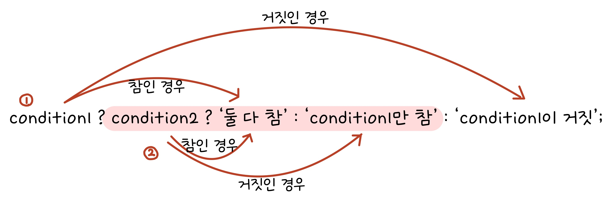
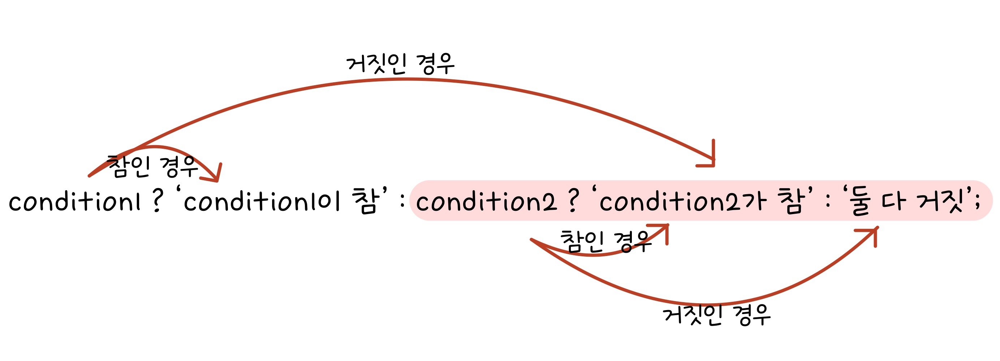

# 기본 문법 배우기_6

## 조건문

주어진 조건에 따라 코드를 실행하거나 실행하지 않는 문이다.

조건문은 조건식과 동작문으로 구분된다.

```
if (조건식)
    동작문;
```

조건식이 참이면 동작문이 실행되고, 거짓이면 동작문이 실행되지 않는다.

만약 동작문이 하나 이상이면, 동작문들을 중괄호로 감싼다.

```
if (조건식) {
    동작문 1;
    동작문 2;
}
```

**<예시>**

```
if (true) {
    console.log('Hello, if!');
}
// Hello, if!

let condition = true;
if (condition) {
    console.log('Hello, if!');
}
// Hello, if!
```

### else를 사용해 두 방향으로 분기하기

**if-else문의 기본 형식**

```
if (조건식) { // 조건식이 참인 값일 때 실행
    동작문;
} else { // 조건식이 거짓인 값일 때 실행
    동작문;
}
```

**<예시>**

```
if (false) {
    console.log('Hello, if!');
} else {
    console.log('Hello, else!');
}
// Hello, else!
```

### else if를 사용해 여러 방향으로 분기하기

**if-else if-else문의 기본 형식**

```
if (조건식) {
    동작문;
} else if (조건식) {
    동작문;
} else {
    동작문;
}
```

`else if`문 뒤에 `else`문이 반드시 나와야하는 것은 아니다.

### 중첩 if 조건문 사용하기

조건문 내에 조건문을 또 사용할 수 있다.

```
let first = true;
let second = false;
if (first) {
    console.log('첫 번째 조건 충족!');
    if (second) {
        console.log('두 번째 조건도 충족!');
    } else {
        console.log('두 번째 조건은 불충족!');
    }
} else {
    console.log('첫 번째 조건 불충족!');
}
// 첫 번째 조건 충족!
// 두 번째 조건은 불충족!
```

중첩 if문은 최대한 피하는 것이 좋다.

### switch 조건문으로 분기하기

**switch문의 기본 형식**

```
switch (조건식) {
    case 비교 조건식:
        동작문;
}
```

switch문에는 조건식이 2개 나온다.

조건식이랑 비교 조건식이랑 같으면 동작문을 실행한다.

```
let value = 'A';
switch (value) {
    case 'A':
        console.log('A');
}
// 'A'
```

여러 방향으로 분기할 수도 있다.

```
let value = 'B';
switch (value) {
    case 'A':
        console.log('A');
    case 'B':
        console.log('B');
    case 'C':
        console.log('C');
}
// B
// C
```

switch문은 일치하는 case를 발견하면 일치 여부와 상관없이 그 아래의 case들의 동작문을 모두 실행한다.

즉, 원하는 결과만 얻고자 한다면 `break문`을 사용해야 한다.

```
let value = 'B';
switch (value) {
    case 'A':
        console.log('A');
        break;
    case 'B':
        console.log('B');
        break;
    case 'C':
        console.log('C');
        break;
}
// B
```

`default`라는 예약어는 어떠한 case도 일치하지 않을 때 동작하는 case이다.

```
let value = 'F';
switch (value) {
    case 'A':
        console.log('A');
        break;
    case 'B':
        console.log('B');
        break;
    case 'C':
        console.log('C');
        break;
    default:
        console.log('아무것도 일치하지 않음');
}
// 아무것도 일치하지 않음
```

### if문 VS switch문

**<if문>**

```
let fruit = '사과';
if (fruit == '사과') {
    console.log('사과입니다!');
} else if (fruit == '배') {
    console.log('배입니다!');
} else if (fruit == '포도') {
    console.log('포도입니다!');
} else {
    console.log('뭔지 모르겠습니다!');
}
// 사과입니다!
```

**<switch문>**

```
let fruit = '사과';
switch (fruit) {
    case '사과':
        console.log('사과입니다!');
        break;
    case '배':
        console.log('배입니다!');
        break;
    case '포도':
        console.log('포도입니다!');
        break;
    default:
        console.log('뭔지 모르겠습니다!');
        break;
}
// 사과입니다!
```

## 조건부 연산자 사용하기

조건부 연산자 또는 삼항 연산자로서 표현한다.

조건부 연산자는 문이 아니라 식이기 때문에 결과값이 나온다.

**조건부 연산자의 기본 형식**

```
조건식 ? 참일 때 실행되는 식 : 거짓일 때 실행되는 식
```

**<예시>**

```
5 > 0 ? '참입니다' : '거짓입니다';
// "참입니다"
```

```
let value = 5 < 0 ? '참입니다' : '거짓입니다';
// undefined
value;
// "거짓입니다"
```

**조건부 연산을 if문으로 변경**

```
let condition = true;
let value = condition ? '참' : '거짓';
console.log(value);
// "참"

if (condition) {
    value = '참';
} else {
    value = '거짓';
}
console.log(vlaue);
// "참"
```

조건부 연산도 중첩이 가능하다.

```
let condition1 = true;
let condition2 = false;
let value = condition1 ? (condition2 ? '둘 다 참' : 'condition1만 참') : 'condition1이 거짓';
console.log(value);
// condition1만 참
```



```
let condition1 = false;
let condition2 = true;
let value = condition1 ? 'condition1이 참' : condition2 ? 'condition2가 참' : '둘 다 거짓';
console.log(value);
// condition2가 참
```

