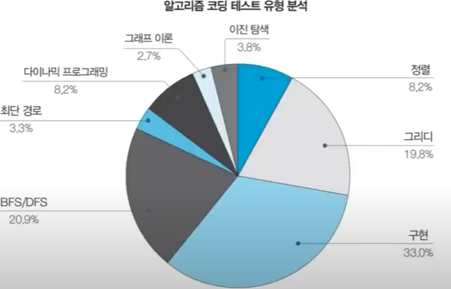

# 코딩 테스트에 대해

## 코딩 테스트의 유형

- 온라인 코딩 테스트
- 오프라인 코딩 테스트

## 유리한 프로그래밍 언어
알고리즘 문제 풀이 방식의 코딩 테스트에서 가장 유리한 프로그래밍 언어는?

1. C++
2. Python

## 가장 출제 빈도가 높은 알고리즘 유형

- 그리디 (쉬운 난이도)
- 구현
- DFS/BFS를 활용한 탐색

## 주요 기업 코딩 테스트 유형 분석

- **삼성전자**

  - 2문제를 모두 맞혀야만 통과
  - 완전 탐색, 시뮬레이션, 구현, DFS/BFS

- **카카오**

  - 절반 이상 맞으면 통과
  - 구현, 이진 탐색, 자료구조 => 추천 시스템 개발

- **라인**

  - 절반 이상 맞으면 통과 
  - 탐색, 구현, 문자열, 다이나믹 프로그래밍
  - 자료구조, 완전 탐색, 구현