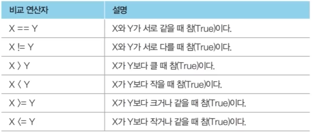
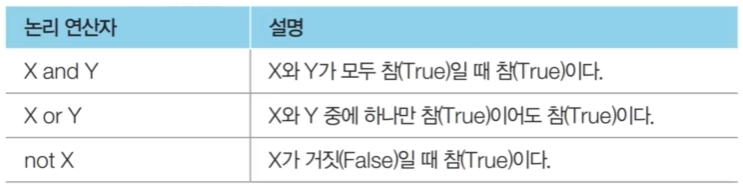
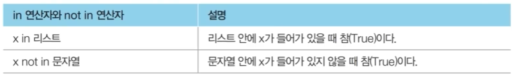

# 조건문

- 조건문은 **프로그램의 흐름을 제어하는 문법**이다.

- 조건문을 이용해 조건에 따라서 프로그램의 로직을 설정할 수 있다.

### 조건문 예제

```
x = 15

if x >= 10:
    print("x >= 10") 

if x >= 0:
    print("x >= 0") 

if x >= 30:
    print("x >= 30")

# x >= 10
# x >= 0
```

## 들여쓰기

- 파이썬에서는 **코드의 블록(Block)을 들여쓰기(Indent)로 지정**한다.

- 다음의 코드에서 2번 라인은 무조건 실행된다.

```
score = 85

if score >= 70:
    print('성적이 70점 이상입니다.')
    if score >= 90:
        print('우수한 성적입니다')
else:
    print('성적이 70점 미만입니다.') # 1번
    print('조금 더 분발하세요.') # 1번

print('프로그램을 종료합니다.') # 2번

# 성적이 70점 이상입니다.
# 프로그램을 종료합니다.
```

- 탭을 사용하는 쪽과 공백 문자(space)를 여러 번 사용하는 쪽으로 두 진영이 있다.

    - 이에 대한 논쟁은 지금까지도 활발하다.

- 파이썬 스타일 가이드라인에서는 **4개의 공백 문자를 사용하는 것을 표준으로 설정**하고 있다.

## 조건문의 기본 형태

- 조건문의 기본적인 형태는 **if ~ elif ~ else**이다.

    - 조건문을 사용할 때 elif 혹은 else 부분은 경우에 따라서 사용하지 않아도 된다.

```
if 조건문 1:
    조건문 1이 True일 때 실행되는 코드
elif 조건문 2:
    조건문 1에 해당하지 않고, 조건문 2가 True일 때 실행되는 코드
else:
    위의 모든 조건문이 모두 True 값이 아닐 때 실행되는 코드
```

### 성적 구간에 따른 학점 출력 예제

- 성적이 90점 이상일 때: A

- 성적이 90점 미만, 80점 이상일 때: B

- 성적이 80점 미만, 70점 이상일 때: C

- 성적이 70점 미만일 때: F

```
score = 85

if score >= 90:
    print("학점: A")
elif score >= 80:
    print("학점: B")
elif score >= 70:
    print("학점: C")
else:
    print("학점: F")

# 학점: B
```

## 비교 연산자

- 비교 연산자는 **특정한 두 값을 비교할 때 이용**할 수 있다.

    - 대입 연산자(=)와 같음 연산자(==)의 차이점에 유의해야 한다.



## 논리 연산자

- 논리 연산자는 **논리 값 (True/False) 사이의 연산을 수행할 때 사용**한다.



## 파이썬의 기타 연산자

- 다수의 데이터를 담는 자료형을 위해 **in 연산자**와 **not in 연산자**가 제공된다.

    - 리스트, 튜플, 문자열, 딕셔너리 모두에서 사용이 가능하다.



## 파이썬의 pass 키워드

- **아무것도 처리하고 싶지 않을 때 pass 키워드를 사용**한다.

- 예시: 디버깅 과정에서 일단 조건문의 형태만 만들어 놓고 조건문을 처리하는 부분은 비워놓고 싶은 경우

```
score = 85

if score >= 80:
    pass # 나중에 작성할 소스코드
else:
    print('성적이 80점 미만입니다.')

print('프로그램을 종료합니다.')

# 프로그램을 종료합니다.
```

## 조건문의 간소화

- 조건문에서 실행될 소스코드가 한 줄인 경우, 굳이 줄 바꿈을 하지 않고도 간략하게 표현할 수 있다.

```
score = 85

if score >= 80: result = "Success"
else: result = "Fail"

# Success
```

- 조건부 표현식(Conditional Expression)은 **if ~ else문을 한 줄에 작성**할 수 있도록 해준다.

```
score = 85
result = "Success" if score >= 80 else "Fail"

print(result)

# Success
```

## 파이썬 조건문 내에서의 부등식

- 다른 프로그래밍 언어와 다르게 파이썬은 조건문 안에서 수학의 부등식을 그대로 사용할 수 있다.

- 예를 들어 **`x > 0 and x < 20`** 과 **`0 < x < 20`** 은 같은 결과를 반환한다.

    - **코드 스타일 1**

        ```
        x = 15
        if x > 0 and x < 20:
            print("x는 0 이상 20 미만의 수 입니다.")
        ```
    
    - **코드 스타일 2**

        ```
        x = 15
        if 0 < x < 20:
            print("x는 0 이상 20 미만의 수 입니다.")
        ```