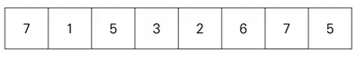
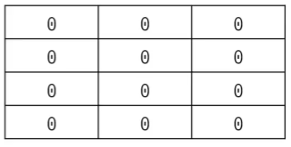
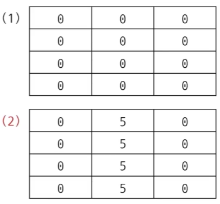
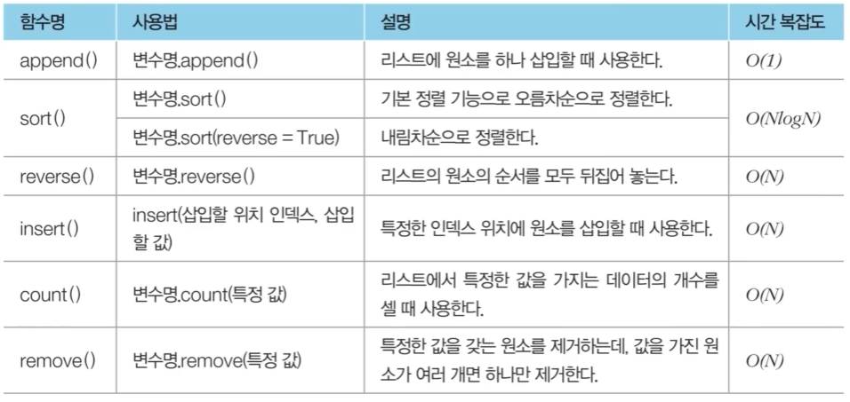

# 리스트 자료형

- **여러 개의 데이터를 연속적으로 담아 처리하기 위해 사용하는 자료형**이다.

    - 사용자 입장에서 C나 자바에서의 배열(Array)의 기능 및 연결 리스트와 유사한 기능을 지원한다.
    - C++의 STL vector와 기능적으로 유사하다.
    - 리스트 대신에 배열 혹은 테이블이라고 부르기도 한다.



## 리스트 초기화

- 리스트는 대괄호([]) 안에 원소를 넣어 초기화하며, 쉼표(,)로 원소를 구분한다.
- 비어 있는 리스트를 선언하고자 할 때는 list() 혹은 간단히 [] 를 이용할 수 있다.
- 리스트의 원소에 접근할 때는 인덱스(index) 값을 괄호에 넣는다.

    - **<span style="color:red">인덱스는 0부터 시작한다.</span>**

```
# 직접 데이터를 넣어 초기화
a = [1, 2, 3, 4, 5, 6, 7, 8, 9]
print(a) # [1, 2, 3, 4, 5, 6, 7, 8, 9]

# 네 번째 원소만 출력
print(a[3]) # 4

# 크기가 N이고, 모든 값이 0인 1차원 리스트 초기화
n = 10
a = [0] * n
print(a) # [0, 0, 0, 0, 0, 0, 0, 0, 0, 0]
```

## 리스트의 인덱싱과 슬라이싱

- 인덱스 값을 입력하여 **리스트의 특정한 원소에 접근하는 것을 인덱싱(Indexing)** 이라고 한다.

    - 파이썬의 인덱스 값은 양의 정수와 음의 정수를 모두 사용할 수 있다.
    - 음의 정수를 넣으면 원소를 거꾸로 탐색하게 된다.

        - 인덱스에 -1을 넣으면 가장 마지막 원소가 출력된다.

```
a = [1, 2, 3, 4, 5, 6, 7, 8, 9]

# 여덟 번째 원소만 출력
print(a[7]) # 8

# 뒤에서 첫 번째 원소 출력
print(a[-1]) # 9

# 뒤에서 세 번째 원소 출력
print(a[-3]) # 7

# 네 번째 원소 값 변경
a[3] = 7
print(a) # [1, 2, 3, 7, 5, 6, 7, 8, 9]
```

- 리스트에서 **연속적인 위치를 갖는 원소들을 가져와야 할 때는 슬라이싱(Slicing)** 을 이용한다.

    - 대괄호 안에 콜론(:)을 넣어서 **시작 인덱스**와 **끝 인덱스**를 설정할 수 있다.
    - **<span style="color:red">끝 인덱스는 실제 인덱스보다 1을 더 크게 설정한다.</span>**

```
a = [1, 2, 3, 4, 5, 6, 7, 8, 9]

# 네 번째 원소만 출력
print(a[3]) # 4

# 두 번째 원소부터 네 번재 원소까지
print(a[1:4]) # [2, 3, 4]
```

## 리스트 컴프리헨션

- 리스트를 초기화하는 방법 중 하나이다.

    - **대괄호 안에 조건문과 반복문을 적용하여 리스트를 초기화** 할 수 있다.
    - 반복문 먼저 작성 후 출력할 값 작성

```
# 0부터 9까지의 수를 포함하는 리스트
array = [i for i in range(10)]

print(array) # [0, 1, 2, 3, 4, 5, 6, 7, 8, 9]
```

```
# 0부터 19까지의 수 중에서 홀수만 포함하는 리스트
array = [i for i in range(20) if i % 2 == 1]

print(array) # [1, 3, 5, 7, 9, 11, 13, 15, 17, 19]
```

```
# 1부터 9까지의 수들의 제곱 값을 포함하는 리스트
array = [i * i for i in range(1, 10)]

print(array) # [1, 4, 9, 16, 25, 36, 49, 64, 81]
```

### 리스트 컴프리헨션과 일반적인 코드 비교하기

- **코드 1: 리스트 컴프리헨션**

    ```
    # 0부터 19까지의 수 중에서 홀수만 포함하는 리스트
    array = [i for i in range(20) if i % 2 == 1]

    print(array) # [1, 3, 5, 7, 9, 11, 13, 15, 17, 19]
    ```

- **코드 2: 일반적인 코드**

    ```
    # 0부터 19까지의 수 중에서 홀수만 포함하는 리스트
    array = []
    for i in range(20):
        if i % 2 == 1:
            array.append(i)
    
    print(array)
    ```

- 리스트 컴프리헨션은 **2차원 리스트를 초기화할 때 효과적으로 사용**될 수 있다.
- 특히 **N * M 크기**의 2차원 리스트를 한 번에 초기화 해야 할 때 매우 유용하다.

    - 좋은 예시: array = [[0] * m for _ in range(n)]

- 만약 2차원 리스트를 초기화할 때 다음과 같이 작성하면 예기치 않은 결과가 나올 수 있다.

    - 잘못된 예시: array = [[0] * m] * n
    - 위 코드는 **전체 리스트 안에 포함된 각 리스트가 모두 같은 객체로 인식** 된다.

### 리스트 컴프리헨션 (좋은 예시)

```
# N * M 크기의 2차원 리스트 초기화
n = 4
m = 3
array = [[0] * m for _ in range(n)]
print(array) # [[0, 0, 0], [0, 0, 0], [0, 0, 0], [0, 0, 0]]
```


### 리스트 컴프리헨션 (잘못된 예시)

```
# N * M 크기의 2차원 리스트 초기화 (잘못된 방법)
n = 4
m = 3
array = [[0] * m] * n
print(array) # [[0, 0, 0], [0, 0, 0], [0, 0, 0], [0, 0, 0]]

array[1][1] = 5
print(array) # [[0, 5, 0], [0, 5, 0], [0, 5, 0], [0, 5, 0]]
```


## 언더바는 언제 사용하나요?

- 파이썬에서는 반복을 수행하되 반복을 위한 변수의 값을 무시하고자 할 때 **언더바(_)** 를 자주 사용한다.

    - **코드 1: 1부터 9까지의 자연수를 더하기**

        ```
        summary = 0
        for i in range(1, 10):
            summary += i
        print(summary)
        ```
    
    - **코드 2: "Hello World"를 5번 출력하기**

        ```
        for _ in range(5):
            print("Hello World")
        ```

## 리스트 관련 기타 메서드



```
a = [1, 4, 3]
print("기본 리스트: ", a) # 기본 리스트: [1, 4, 3]

# 리스트에 원소 삽입
a.append(2)
print("삽입: ", a) # 삽입: [1, 4, 3, 2]

# 오름차순 정렬
a.sort()
print("오름차순 정렬: ", a) # 오름차순 정렬: [1, 2, 3, 4]

# 내림차순 정렬
a.sort(reverse = True)
print("내림차순 정렬: ", a) # 내림차순 정렬: [4, 3, 2, 1]
```

```
a = [4, 3, 2, 1]

# 리스트 원소 뒤집기
a.reverse()
print("원소 뒤집기: ", a) # 원소 뒤집기: [1, 2, 3, 4]

# 특정 인덱스에 데이터 추가
a.insert(2, 3)
print("인덱스 2에 3 추가: ", a) # 인덱스 2에 3 추가: [1, 2, 3, 3, 4]

# 특정 값인 데이터 개수 세기
print("값이 3인 데이터 개수: ", a.count(3)) # 값이 3인 데이터 개수: 2

# 특정 값 데이터 삭제
a.remove(1)
print("값이 1인 데이터 삭제: ", a) # 값이 1인 데이터 삭제: [2, 3, 3, 4]
```

### 리스트에서 특정 값을 가지는 원소를 모두 제거하기

```
a = [1, 2, 3, 4, 5, 5, 5]
remove_set = {3, 5} # 집합 자료형 (존재 유무만 파악)

# remove_list에 포함되지 않은 값만을 저장
result = [i for i in a if i not in remove_set]
print(result) # [1, 2, 4]
```